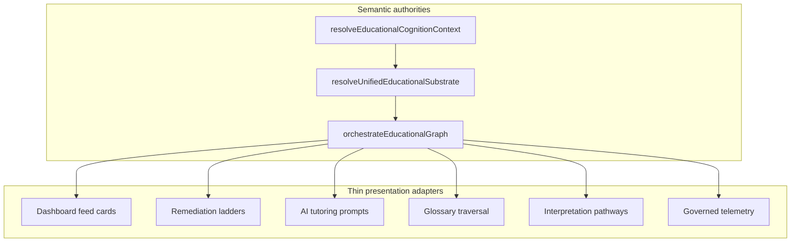

# RN Educational Graph — Fifth + Sixth (Runtime Closure) Pass

**Date:** 2026-05-20  
**Status:** Graph substrate authoritative; runtime closure modules landed; residual debt narrowed to Study Coach API and tutor session routes.

## Executive summary

This pass hardens the transition from centralized orchestration with partial legacy consumers to a **single governed Educational Graph + Educational Cognition OS**. The three semantic authorities remain:

- `resolveUnifiedEducationalSubstrate()`
- `resolveEducationalCognitionContext()`
- `orchestrateEducationalGraph()`

Downstream surfaces should be presentation adapters only. Fifth-pass work focused on **dashboard feed substrate**, **graph telemetry at interaction boundaries**, **AI prompt graph ordering**, **glossary scale-up**, **CI orchestration enforcement**, and **observability metric codes**.

---

## 1. Graph telemetry convergence

### Wired (client)

| Surface | Mechanism |
|---------|-----------|
| Lesson remediation ladders | `GovernedRemediationCTA`, pathway chain client |
| Topic hub pills | `topic-hub-learning-graph-client` |
| Glossary traversal | `GovernedGlossaryTraversal` |
| Interpretation entry | `GovernedInterpretationLink` |
| Adaptive / dashboard next actions | `GovernedNextActionLink` |
| Post-exam coaching | `GovernedCoachingRemediationLink`, dashboard bridge |
| Learner coaching dashboard cards | `LearnerCoachingDashboardPanel` + graph actions |

### Server bridge

- `captureGovernedGraphTelemetryServer()` → `captureGovernedLearnerProductEvent()` for authenticated `/app` surfaces.

### Payload normalization

- `governed-graph-telemetry-props.ts` — `competency_id`, `graph_depth`, `ontology_namespace`, `remediation_pathway`, `testing_model`, `cognition_capabilities`, `source_surface`, `learner_state_reason`.

### Residual telemetry debt

- Study-plan and some coaching paths still use `recordCoachingTelemetry` alongside governed graph events (dual envelope until unified).
- Interpretation **compact panels** without graph steps still need step materialization at click time.
- AI tutor **launch UI** should call `captureGovernedGraphTelemetry` with `graph_step_clicked` when session starts (provider layer ready; entry routes need props).

---

## 2. Dashboard feed orchestration audit

### Before

`composeDashboardOrchestrationV3()` built cards from session feed + local weak-area heuristics.

### After

- `resolveDashboardSubstrateOrchestration()` → `composeDashboardOrchestrationFromSubstrate()` → `buildDashboardGraphActions()`.
- `composeDashboardOrchestrationV3()` **prefers substrate** when `pathwayId` is present in session learner state; exposes optional `graphActions` on the V3 shape.
- `LearnerCoachingDashboardPanel` maps `graph-{stepId}` cards to `GovernedNextActionLink` with full `EduGraphStep` telemetry.

### Divergence guard

- `dashboard_graph.divergence` metric code registered in `graph-governance-observability.ts`.

---

## 3. AI prompt graph-ordering migration

- `composeTutoringPromptFromGraphSteps()` — `REMEDIATION_GRAPH_ORDER` block from `EduGraphStep[]` only.
- `StubTutoringProvider` uses graph-ordered composition when `graphSteps` present on `TutoringPromptContext`.
- `tutoringPromptContextFromAiEnvelope()` bridges cognition envelope → tutoring provider input.
- `buildAiTutorContextFromCognition()` supplies graph steps to envelope (not legacy recommendation rows).

### Residual

- Production tutor entry routes must pass `graphSteps` on every `TutoringPromptContext` build (helper exported; not all call sites audited).

---

## 4. Authenticated telemetry governance

- Server capture path: `capture-governed-graph-telemetry-server.ts`.
- Cognition V5: `emitCognitionTelemetryV5` on study plan / AI context generation.
- **Next:** Wire server capture on RSC dashboard load, study-plan save, remediation review completion.

---

## 5. Route canonicalization audit

- `scripts/audit-route-canonicalization.mjs` — expanded to `.markdown` in content/blog/scripts/longtail seeds.
- **CI:** `OK — no legacy /canada/rpn/rex-pn` (allowlisted redirects/tests only).
- Canonical Canada PN: `/canada/pn/rex-pn`.

---

## 6. Glossary graph expansion audit

- `nursing-glossary-competency-generated.ts` — competency-linked + supplemental batch.
- Registry merge: core + expansion + competency-generated.
- `GlossaryGraphMetadata` extended: `telemetryNamespace`, `interpretationTopicSlug`, `remediationTopicSlug`.
- **Contract:** `glossary-governance.contract.test.ts` — ≥150 terms (phased toward 200+ target), zero audit issues on sample metadata.

---

## 7. Graph-only orchestration enforcement (CI)

New: `graph-orchestration-enforcement.contract.test.ts`

- Blocks new `TOPIC_INTERPRETATION_SLUG` maps outside `graph-href-builders.ts`.
- Asserts governed telemetry modules do not call `posthog.capture` directly.
- Asserts prompt composition and dashboard substrate modules reference graph authorities.

---

## 8. Educational Graph OS architecture (target)



---

## 9. Tests run (fifth pass)

```bash
node --import tsx --test \
  nursenest-core/src/lib/educational-graph/*.contract.test.ts \
  nursenest-core/src/lib/educational-cognition/*-governance.contract.test.ts \
  nursenest-core/src/lib/educational-cognition/adaptive-recommendation.contract.test.ts \
  nursenest-core/src/lib/linking/seo-graph-hardening.contract.test.ts \
  nursenest-core/src/lib/ai-tutor/prompt-composition.test.ts

node nursenest-core/scripts/audit-route-canonicalization.mjs
```

---

## 10. Remaining semantic debt inventory

| Priority | Item | Status after runtime closure |
|----------|------|------------------------------|
| P0 | Plumb `graphSteps` on all AI tutor API/session entry points | Helpers ready; `/api/coach` and tutor shell still separate |
| P0 | Interpretation entry `EduGraphStep` materialization | **Done** — hub uses `GovernedInterpretationLink` |
| P1 | Server graph telemetry on dashboard RSC + adaptive API | **Done** — `emitLearnerDashboardGraphTelemetry`, adaptive route |
| P1 | Coaching telemetry graph lineage | **Done** — `coaching-graph-telemetry-bridge` + V5 merge |
| P1 | Glossary as native orchestrator nodes | **Done** — `glossary_traversal` surface + `buildGlossaryGraphNode` |
| P2 | Remove `buildDashboardCards` legacy fallback | Deprecated; substrate default pathway when session empty |
| P2 | Study-plan / remediation review server capture | Pending dedicated hooks |

---

## Sixth pass — graph runtime closure (this delivery)

### Universal tutoring continuity

- `ai-tutor-substrate-governance.ts` — `resolveTutoringGraphSteps`, `buildGovernedTutoringPromptContext`, lineage snapshots, drift assertions.
- `tutoring-continuity-replay.ts` — session checkpoint recovery with replay divergence detection.
- Contract: `ai-tutor-substrate-governance.contract.test.ts`.

### Authenticated server graph telemetry

- `governed-server-telemetry.ts` — `emitGovernedServerGraphTelemetry()` with full lineage envelope.
- `graph-lineage-envelope.ts` — `pathwayId`, `graphVersion`, `ontologyRevision`, `educationalIntent`, `testing_model`, `cognitionReliabilityTier`, `continuityCheckpointId`.
- Wired: learner dashboard RSC, adaptive recommendations API, adaptive wire projection.
- Contract: `server-telemetry-lineage.contract.test.ts`.

### Glossary native traversal

- New `GraphSourceSurface`: `glossary_traversal` (orchestrator emits glossary steps on glossary surfaces).
- `glossary-graph-node.ts` uses native traversal; validation prevents orphan nodes.

### Interpretation graph materialization

- `interpretation-graph-step-materialization.ts` + `ClinicalInterpretationGuideCard` on hub listing.

### Coaching telemetry convergence

- `coaching-graph-telemetry-bridge.ts` merges graph lineage into authoritative coaching events.
- Cognition V5 emits graph lineage props on every governed event.

### Replayable graph runtime

- `graph-runtime-replay.ts` — dashboard, remediation, adaptive, interpretation replay snapshots.
- Contract: `graph-runtime-replay.contract.test.ts`, `graph-resilience.contract.test.ts`.

### Runtime resilience

- `graph-substrate-integrity.ts` — healthy / degraded / conflicting / orphaned tiers + step salvage.
- `ontology-runtime-integrity.ts` — namespace conflict detection + replay reconciliation.

### CI

- **48** graph/cognition contract tests passing (includes new closure suites).
- `audit-rn-coaching-governance.mjs` extended for runtime closure modules.

---

## Files touched (representative)

- `governed-server-telemetry.ts`, `graph-lineage-envelope.ts`, `graph-runtime-replay.ts`
- `ai-tutor-substrate-governance.ts`, `tutoring-continuity-replay.ts`
- `interpretation-graph-step-materialization.ts`, `clinical-interpretation-guide-card.tsx`
- `emit-learner-dashboard-graph-telemetry.ts`, `coaching-graph-telemetry-bridge.ts`
- `graph-substrate-integrity.ts`, `ontology-runtime-integrity.ts`
- `dashboard-orchestration-v3.ts`, `adaptive-wire-cognition-projection.ts`
- `app/(learner)/page.tsx`, `api/learner/adaptive-recommendations/route.ts`
- `*.contract.test.ts` (tutor, replay, glossary, server lineage, resilience)
