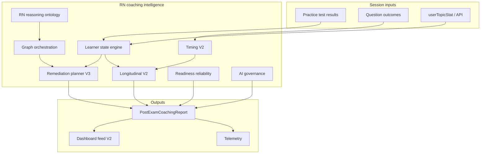

# RN Coaching Intelligence Engine — Third-Pass Architecture & Governance Audit

**Status:** Active architecture (v3 expansion)  
**Scope:** RN / NCLEX learner coaching (`post-exam-coaching`, educational graph, dashboard continuity)  
**Branch context:** `feat/np-loft-exam-shell` (pathway-safe semantics preserved)

---

## Executive summary

Phase 1–2 established psychometrically governed post-exam coaching. Phase 3 evolves that stack into a **unified RN competency-state intelligence engine** without schema migrations: longitudinal state composes from `userTopicStat`, session outcomes, client persistence, and the existing `rn-competency-ontology` graph.

**North star:** clinically intelligent remediation that models reasoning, personalizes safely, and never leaks CAT psychometrics into LOFT.

---

## 1. Full coaching intelligence audit

| Module | Finding | Action |
|--------|---------|--------|
| `build-coaching-report.ts` | `validateCoachingCopyForPathway` was unreachable after `return` | **Fixed** — validation runs before return |
| `build-coaching-report.ts` + `post-exam-performance-report.ts` | Duplicate timing builders (session vs coaching) | Coaching path owns V2; base report keeps lightweight fallback |
| `competency-graph-steps.ts` | Parallel to `remediation-ladder-v2.ts` (marketing) | **Converged** — graph orchestration delegates to ontology + interpretation registry |
| `recommendation-orchestrator.ts` | No learner-state or modality rotation | **V3** — uses `RnLearnerStateSnapshot` + fatigue caps |
| `longitudinal-memory.ts` | `recurringTimingIssue` always false; shallow narratives | **V2** — volatility, plateau, hesitation persistence |
| `timing-intelligence.ts` | No fatigue curve, SATA/matrix heuristics, event ingest | **V2** — cognitive-behavior layer + `question-performance-events` bridge |
| `clinical-judgment-patterns.ts` | 10 patterns; shallow NCJ mapping | **Expanded** — formal RN reasoning ontology |
| `readiness-reliability.ts` | Good LOFT cap; no certainty labels for AI | **Governance** — certainty tier + claim allowlist |
| `dashboard-feed.ts` | Session-only v1 feed | **V2** — momentum, pacing, weakness clusters |
| `remediation-exposure.ts` | Client-only; no server sync | Acceptable v1; state engine tracks fatigue score |
| `coaching-semantics.ts` | Solid CAT/LOFT split | Keep; AI validator reuses |

### Risk register (technical debt)

| ID | Debt | Severity | Mitigation |
|----|------|----------|------------|
| TD-01 | Learner state not in DB | Medium | `userTopicStat` + `nn_rn_learner_state_v1` localStorage until product approves migration |
| TD-02 | Per-question dwell not wired from practice runner | Medium | `ingestTimingFromPerformanceEvents()` ready; wire on submit |
| TD-03 | LOFT case completion skips enriched state | Low | Share `buildEnrichedPostExamPerformanceReport` for cases |
| TD-04 | Cohort/educator dashboards | Future | State snapshot API shape is forward-compatible |
| TD-05 | AI tutor not centralized | Medium | `ai-coaching-governance.ts` middleware + allowlists |

---

## 2. Unified learner-state engine

**Location:** `nursenest-core/src/lib/learner/rn-coaching-intelligence/`

```
learner-state-types.ts      — snapshot schema
hydrate-learner-state.ts    — server topic perf + weak rows → state
learner-state-store.ts      — persist / merge (client)
apply-session-delta.ts      — post-exam session updates state
```

**Tracks:** competency mastery (via ontology), readiness trajectory, pacing/hesitation profiles, reasoning pattern recurrence, measurement weaknesses, remediation fatigue.

**Persistence:** bounded localStorage (220-event parity with question perf) + hydrate from `loadUnifiedTopicPerformance` on report mount (existing API extended).

---

## 3. RN clinical reasoning taxonomy

**Location:** `rn-reasoning-ontology.ts`

Aligns with NCLEX Clinical Judgment Model layers (recognize cues → analyze → prioritize → generate solutions → evaluate) and NCSBN domains. Maps coach codes + measurement signals to educator-safe patterns.

Patterns added: `abc_prioritization_failure`, `unstable_patient_miss`, `expected_unexpected_confusion`, `intervention_sequencing_error`, `trend_recognition_failure`, `escalation_hesitation`, `lab_trend_reasoning_gap`.

---

## 4. Timing intelligence V2

**Location:** `timing-intelligence-v2.ts`

| Signal | Detection |
|--------|-----------|
| Reread / answer-change | `timingByQuestionId` + events |
| Fatigue curve | Last 25% items faster wrong or slower hesitant |
| SATA hesitation | SATA type + high dwell |
| Rapid-guess cluster | ≥3 items &lt;8s in same topic |
| Confidence instability | high wrong + low correct mix |
| Late-session deterioration | accuracy drop in final quartile |

Integrates `readQuestionPerformanceEvents()` when `userId` present (client-only).

---

## 5. Competency graph orchestration

**Location:** `competency-graph-orchestration.ts`

Ladder (RN):

1. Mechanism / cue recognition  
2. Assessment interpretation (labs, ABG, trends)  
3. Prioritization drill  
4. Intervention sequencing (mixed cases)  
5. Flashcards (retention)  
6. Reassessment → retention verification  

Uses `resolveRnCompetencyForTopic`, `publishedMechanismForTopic`, `publishedInterpretationForTopic` (from remediation-ladder-v2 patterns).

---

## 6. Recommendation orchestration V3

**Location:** `remediation-planner-v3.ts`

- Prioritize **unstable** competencies (`perfusion_hemodynamics`, `infection_sepsis`, `respiratory_instability`) when weak  
- Rotate modalities when `remediationFatigueScore` high  
- Escalate graph depth from exposure + state volatility  
- Cap at 5; never duplicate hrefs  
- LOFT/CAT semantics from `testing-model-presentation`

---

## 7. Longitudinal memory V2

**Location:** `longitudinal-memory.ts` (expanded)

Narrative templates:

- Improving but inconsistent  
- Persistent hesitation despite correct outcomes  
- Strong recognition, weak intervention sequencing  
- Fast responder with elevated unsafe misses  
- Plateau after remediation  

---

## 8. Reliability + readiness governance

**Location:** `readiness-reliability.ts` + `coaching-claim-governance.ts`

| Reliability | Pass outlook | Longitudinal claims | AI tutoring |
|-------------|--------------|---------------------|-------------|
| low | suppressed | trend-only wording | no pass prediction |
| moderate | banded | directional | suggest more data |
| high | allowed if coach omits false | stable claims | full remediation |

LOFT: `score` capped; no theta/SE/adaptive copy (existing + validator).

---

## 9. Dashboard intelligence V2

**Location:** `dashboard-feed.ts` → `DashboardIntelligenceFeed`

Surfaces: weakness clusters, readiness momentum (trajectory), pacing/hesitation trend labels, next-best-action, study momentum line.

Consumed by `PostExamDashboardBridgeBanner` + future adaptive study plan API.

---

## 10. Knowledge graph integration

Coaching recommendations resolve:

- `resolveRnCompetencyForTopic(topic)`  
- `buildRnRemediationGraphSteps()` (interpretation + mechanism hrefs)  
- Topic hubs via existing `remediation-links`

---

## 11. Measurement + clinical interpretation

`rn-reasoning-ontology.ts` links:

- `acid_base_gas_exchange`, `fluid_electrolyte_balance` → lab trend coaching  
- Coach `labs` code → `lab_trend_reasoning_gap`  
- Interpretation registry slugs (K+, ABG, glucose)

---

## 12. AI tutor governance

**Location:** `ai-coaching-governance.ts`

- `validateCoachingNarrativeForModel()` — LOFT/CAT  
- `validateRemediationRecommendation()` — href allowlist prefix  
- `stripForbiddenPsychometricClaims()`  
- Reuses `validateCoachingCopyForPathway` from `testing-model`

---

## 13. Telemetry + observability

**Location:** `coaching-telemetry.ts`

Events (client, forward-compatible with PostHog):

- `coaching_report_generated`  
- `remediation_cta_clicked`  
- `recommendation_rotated`  
- `readiness_reliability_level`  
- `semantic_integrity_violation` (dev)

---

## 14. Test coverage

`rn-coaching-intelligence/*.test.ts` + expanded `post-exam-coaching.test.ts`

---

## 15. Future architecture hooks

| Capability | Hook |
|------------|------|
| Conversational AI tutor | `RnLearnerStateSnapshot` + governance middleware |
| Adaptive lesson sequencing | `competency-graph-orchestration` depth + prerequisites |
| Educator dashboards | Server hydrate API (same shape as client) |
| Cohort analytics | Aggregate competency IDs (no PII in v1 scripts) |
| Readiness forecasting | `readinessTrajectory[]` + reliability gate |
| Semantic search | Ontology IDs + topic slugs |

---

## Module dependency diagram



---

## File map (implementation)

| Path | Role |
|------|------|
| `src/lib/learner/rn-coaching-intelligence/*` | Learner state + V2/V3 engines |
| `src/lib/learner/post-exam-coaching/*` | Report composition (imports intelligence layer) |
| `src/lib/educational-graph/rn-competency-ontology.ts` | Competency IDs (existing) |
| `docs/architecture/rn-coaching-intelligence-engine-v3.md` | This document |

## Technical debt inventory (remaining)

| ID | Item | Owner action |
|----|------|----------------|
| TD-01 | `post-exam-adaptive-report` UI not on `main` — intelligence layer is standalone under `rn-coaching-intelligence/` | Wire report UI when post-exam shell merges |
| TD-02 | Learner state DB persistence | Product approval for `UserCoachingState` model |
| TD-03 | Practice runner → `ingestTimingFromPerformanceEvents` on submit | One-line hook in runner client |
| TD-04 | `enrich-cat-results-coach` optional attach of `buildRnCoachingIntelligenceReport` | Server hook after CAT complete |
| TD-05 | Educator/cohort aggregates | Batch job over anonymized competency IDs |
| TD-06 | PostHog dashboard for `rn_coaching_*` events | Analytics playbook |

*Last updated: third-pass expansion (implemented on `main` as `rn-coaching-intelligence` module).*
