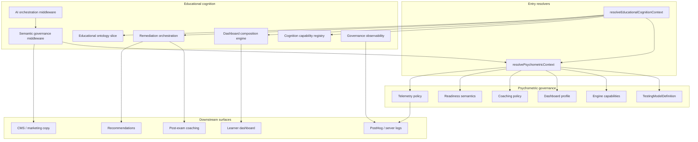

# Educational Cognition Orchestration Architecture (Fifth Pass)

**Status:** Active  
**Branch context:** `feat/rpn-practice-exam-shell` and psychometric governance stack  
**North star:** One capability-driven governance system for learner-state, competency graphs, psychometrics, measurement, remediation, AI tutoring, dashboards, and recommendations.

---

## Executive summary

Passes 1–4 established **psychometric orchestration** (`resolvePsychometricContext`). Pass 5 expands into **educational cognition orchestration** (`resolveEducationalCognitionContext`) so RN coaching intelligence, dashboards, remediation, telemetry, and AI outputs derive from the same contracts — not parallel pathway hacks.

---

## Architecture layers



---

## 1. Full cognition orchestration audit (findings)

| System | Status | Governance source |
|--------|--------|-------------------|
| Psychometric orchestration | **Central** — `psychometric-orchestrator.ts` | Capabilities + policies |
| Learner readiness (`readiness-score.ts`) | **Parallel** — merge via `readinessSemantics` in cognition context | `policies/readiness-policy.ts` |
| Adaptive recommendations | **Parallel** — gate with `capabilities.adaptive_recommendations` | Cognition registry |
| RN coaching intelligence | **Converging** — `buildRnCoachingIntelligenceReport` | Coaching model from psychometric |
| Post-exam coaching (legacy path) | **Exists** — `post-exam-coaching/*` | `testing-coaching-policy` |
| Competency graph | **Ontology-backed** — `rn-competency-ontology` + `competency-graph-orchestration` | Graph + remediation planner |
| Measurement interpretation | **Partial** — tags in `hydrate-learner-state` | Ontology slice (no separate measurement-governance module yet) |
| Dashboard widgets | **Governed** — `dashboard-composition-engine.ts` | Widget eligibility from psychometric profile |
| Telemetry | **Governed** — `governed-learner-analytics` + `cognition-telemetry-governance` | LOFT/CAT isolation |
| AI tutoring / generated copy | **Middleware** — `ai-orchestration-middleware.ts` | Psychometric + coaching validators |
| CMS / marketing | **Policy** — `governOrchestratedMarketingCopy` | `testing-marketing-governance` |

### Technical debt (remaining)

| ID | Item | Priority |
|----|------|----------|
| TD-E01 | Wire `resolveEducationalCognitionContext` into `load-learner-dashboard` | P1 |
| TD-E02 | Replace duplicate `buildAdaptiveRecommendations` calls in insight engine with cognition context | P1 |
| TD-E03 | Client practice-runner unguarded `cat_*` telemetry | P1 |
| TD-E04 | Global marketing hub `governOrchestratedMarketingCopy` enforcement | P2 |
| TD-E05 | DB persistence for `RnLearnerStateSnapshot` | P2 |
| TD-E06 | Measurement-governance module (labs/interpretation engine) | P2 |
| TD-E07 | Educator / cohort dashboards | Future |

---

## 2. Central educational cognition engine

**Entry:** `resolveEducationalCognitionContext(pathwayId, options?)`  
**Location:** `nursenest-core/src/lib/educational-cognition/resolve-educational-cognition-context.ts`

Composes:

- `psychometric` — full `PsychometricOrchestrationContext`
- `capabilities` — cognition feature flags
- `coachingModel` — `loft_readiness` | `cat_adaptive` | `linear_practice`
- `dashboard` — governed widget composition
- `remediation` — fatigue-aware sequencing contract
- `ontology` — competency + measurement + reasoning slice
- `learnerState` — hydrated snapshot (bounded)

Post-session: `resolveEducationalCognitionFromSession(input)` → attaches `RnCoachingIntelligenceReport`.

---

## 3. Learner-state + competency orchestration

- **State schema:** `learner-state-types.ts`
- **Hydration:** `hydrate-learner-state.ts` (topic perf → competency mastery)
- **Graph:** `competency-graph-orchestration.ts` + `rn-competency-ontology.ts`
- **Planner:** `remediation-planner-v3.ts` with fatigue + modality rotation
- **Readiness reliability:** `readiness-reliability.ts` + `coaching-claim-governance.ts`

Readiness numeric score remains in `readiness-score.ts`; **presentation** and **pass-outlook eligibility** come from psychometric readiness semantics.

---

## 4. Dashboard composition engine

**Location:** `dashboard-composition-engine.ts`

- Every widget has `eligible`, `priority`, `label`
- Psychometric widgets use `isDashboardWidgetEligible`
- `showAdaptivePlan` requires both dashboard profile **and** `adaptive_recommendations` capability

---

## 5. Recommendation + remediation orchestration

- **Legacy:** `post-exam-coaching/recommendation-orchestrator.ts`
- **V3:** `remediation-planner-v3.ts` + `remediation-orchestration.ts`
- **Semantics:** `getTestingModelRecommendationSemantics(pathwayId)`

Recommendation fatigue: `remediationFatigueScore` in learner state caps `maxRecommendations`.

---

## 6. Measurement + clinical interpretation

Interpretation weakness tags flow through learner state → ontology slice. Full measurement-governance integration with labs engine is **planned** (TD-E06); instructional content remains authoritative via graph governance (`graph-governance.ts`).

---

## 7. AI + generated content orchestration

- `ai-coaching-governance.ts` — narrative + href allowlists
- `ai-orchestration-middleware.ts` — batch governance for AI blocks
- `semantic-governance-middleware.ts` — psychometric copy at boundaries
- Prompt envelopes should read `resolvePsychometricContext` for framing (existing pattern in AI tutor paths)

---

## 8. Telemetry governance V4

| Layer | Module |
|-------|--------|
| Psychometric capture | `governed-learner-analytics.ts` |
| Study-loop CTAs | `policies/telemetry-policy.ts` |
| Cognition envelope | `cognition-telemetry-governance.ts` |
| Violation counters | `testing-telemetry-governance` + `governance-observability` |

**CI:** `scripts/audit-educational-cognition-governance.ts`

---

## 9. Educational ontology + semantic graph

**Registry:** `educational-ontology-registry.ts`  
**Source of truth:** `educational-graph/rn-competency-ontology.ts`, glossary governance, remediation ladder v2.

Future: unified semantic relationship registry for recommendations and semantic search (TD future).

---

## 10. Presentation + component governance

- No CAT-specific naming on LOFT surfaces (`psychometric-isolation.ts`)
- Dashboard IDs governed via composition engine
- CSS surface classes: `nn-loft-results`, `nn-cat-results`, `nn-linear-results` from presentation layer

---

## 11. CMS + content pipeline

Enforce before publish:

- `governOrchestratedMarketingCopy(pathwayId, text)`
- `governOrchestratedLearnerCopy` for educational intros

---

## 12. Observability strategy

- Server logs: `educational_cognition` / `psychometric_telemetry` scopes
- Counters: `getCognitionGovernanceViolationCount`, `getPsychometricTelemetryViolationCount`
- Future: governance dashboard + semantic drift alerts (PostHog saved insights)

---

## 13. CI governance expansion

| Check | Command / test |
|-------|----------------|
| Psychometric contracts | `node --import tsx --test src/lib/testing/psychometric-governance.contract.test.ts` |
| Orchestration contracts | `node --import tsx --test src/lib/testing/psychometric-orchestration.contract.test.ts` |
| Study-loop telemetry | `node --import tsx --test src/lib/observability/study-loop-cat-analytics.test.ts` |
| RN coaching | `node --import tsx --test src/lib/learner/rn-coaching-intelligence/rn-coaching-intelligence.test.ts` |
| Static audit | `npx tsx scripts/audit-educational-cognition-governance.ts` |

---

## 14. Future architecture

Prepared extension points:

- Conversational AI tutoring (cognition context → tool policy)
- Adaptive lesson sequencing (capability-gated)
- Educator dashboards (snapshot API from `EducationalCognitionContext`)
- Cohort analytics (aggregated ontology slices)
- Competency forecasting (longitudinal memory v2)
- Multi-model orchestration (registry pattern, not enum sprawl)

---

## Key imports

```typescript
import { resolvePsychometricContext } from "@/lib/testing/testing-model";
import {
  resolveEducationalCognitionContext,
  captureCognitionOrchestratedEvent,
} from "@/lib/educational-cognition";
```

CNPLE pathway: `ca-np-cnple` (`CNPLE_PATHWAY_ID`).
