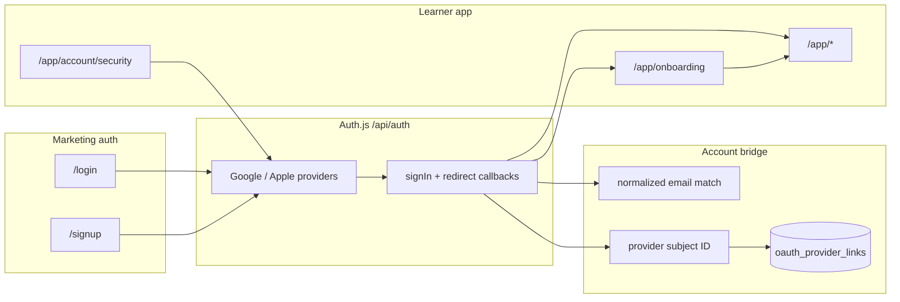

# OAuth production setup and operations

NurseNest uses **Auth.js (NextAuth v5)** with **Google** and **Apple** OAuth, centralized redirect governance (`auth-flow-governance.ts`), email-based account bridging, and immutable **provider subject** rows in `oauth_provider_links`. Credentials sign-in remains the default path when OAuth env vars are unset.

## Architecture overview



**Non-negotiables**

- No parallel auth stack; JWT + DB `credentialVersion` remain authoritative.
- `callbackUrl` and Auth.js `redirect` pass through `resolveAuthJsRedirectUrl` / `resolveAuthReturnDestination` (open-redirect safe).
- OAuth providers are **omitted from the provider list** when env is missing (buttons hidden server-side).
- No OAuth tokens or secrets in logs, analytics, or client bundles.

## Provider enablement

| Provider | Required env | Callback path |
|----------|----------------|---------------|
| Google | `AUTH_GOOGLE_ID`, `AUTH_GOOGLE_SECRET` | `/api/auth/callback/google` |
| Apple | `AUTH_APPLE_ID` + (`AUTH_APPLE_SECRET` **or** Team/Key/.p8) | `/api/auth/callback/apple` |

Shared:

| Variable | Purpose |
|----------|---------|
| `AUTH_SECRET` or `NEXTAUTH_SECRET` | Session JWT signing (≥32 chars in production) |
| `AUTH_URL` or `NEXTAUTH_URL` | **Origin only** (e.g. `https://www.nursenest.ca`) — no `/login` path |
| `AUTH_TRUST_HOST` | `true` behind reverse proxies (DigitalOcean, Vercel) when host headers are trusted |

### Copy-paste env examples

**Local (.env.local)**

```bash
AUTH_URL=http://localhost:3000
AUTH_SECRET=replace-with-openssl-rand-hex-32
AUTH_GOOGLE_ID=
AUTH_GOOGLE_SECRET=
AUTH_APPLE_ID=
# Option A: pre-generated client secret JWT (expires ~6 months)
# AUTH_APPLE_SECRET=
# Option B: generate JWT from .p8
# AUTH_APPLE_TEAM_ID=
# AUTH_APPLE_KEY_ID=
# AUTH_APPLE_PRIVATE_KEY_PATH=./secrets/AuthKey_XXXX.p8
```

**Staging**

```bash
AUTH_URL=https://staging.nursenest.ca
AUTH_SECRET=<from-secrets-manager>
AUTH_TRUST_HOST=true
AUTH_GOOGLE_ID=<staging-oauth-client>
AUTH_GOOGLE_SECRET=<staging-oauth-secret>
AUTH_APPLE_ID=<services-id>
AUTH_APPLE_TEAM_ID=<team-id>
AUTH_APPLE_KEY_ID=<key-id>
AUTH_APPLE_PRIVATE_KEY=<base64-or-pem-with-\n-escaped>
```

**Production**

```bash
AUTH_URL=https://www.nursenest.ca
AUTH_SECRET=<production-secret>
AUTH_TRUST_HOST=true
AUTH_GOOGLE_ID=<prod-client>
AUTH_GOOGLE_SECRET=<prod-secret>
AUTH_APPLE_ID=com.nursenest.web
AUTH_APPLE_SECRET=<rotated-jwt-or-use-p8-trio>
```

## Callback URL setup

Register **exact** redirect URIs with each provider:

- `https://<canonical-origin>/api/auth/callback/google`
- `https://<canonical-origin>/api/auth/callback/apple`

For local dev (if allowed in console):

- `http://localhost:3000/api/auth/callback/google`
- `http://localhost:3000/api/auth/callback/apple`

**Common failure:** `AUTH_URL` includes a path or uses a different host than the browser (www vs apex). Auth.js `basePath` is pinned to `/api/auth` — do not derive it from `AUTH_URL`.

## Apple Sign in with Apple

1. **Services ID** → `AUTH_APPLE_ID` (client id).
2. **Team ID** → `AUTH_APPLE_TEAM_ID`.
3. **Key** → `AUTH_APPLE_KEY_ID` + `.p8` file.
4. **Return URLs** → same callback paths as above.
5. **Domains** → production marketing host.

### Private relay

Apple may return `*@privaterelay.appleid.com`. The bridge matches on email for first link; **provider subject id** in `oauth_provider_links` is authoritative on subsequent sign-ins. Relay usage is audited (`oauth_relay_email_detected`).

### `AUTH_APPLE_SECRET` vs generated JWT

- **`AUTH_APPLE_SECRET`:** Pre-built client secret JWT (Apple max ~180 days). Simplest for DO/Vercel env vars.
- **Team ID + Key ID + private key:** Auth.js builds the JWT at runtime (recommended for rotation automation).

**Expired Apple secret troubleshooting**

- Symptom: `OAuthCallback` / `Configuration` on login, Apple provider errors in logs.
- Fix: Regenerate secret in Apple Developer → update `AUTH_APPLE_SECRET` or rotate `.p8` credentials → redeploy → smoke-test Apple sign-in.

## DigitalOcean deployment

- Set env on the App Platform component (same names as above).
- Ensure `AUTH_TRUST_HOST=true` when TLS terminates at the edge.
- Run DB migration for `oauth_provider_links` before enabling connect/disconnect UI:
  - SQL: `migrations/0004_oauth_provider_links.sql`
  - Or `npx prisma migrate deploy` when a Prisma migration is promoted.
- Confirm `DATABASE_URL` / `DIRECT_URL` for Prisma.

## Vercel deployment

- Add env vars per environment (Preview vs Production).
- `AUTH_URL` must match the deployment’s canonical URL.
- Preview deployments need separate OAuth client redirect URIs if testing OAuth on previews.

## Secure cookies

Production sessions use Auth.js secure cookie names when HTTPS is detected (`__Secure-authjs.session-token`). Proxy must forward `x-forwarded-proto: https`. JWT read fallbacks live in `nextauth-request-jwt.ts`.

| Attribute | Behavior |
|-----------|----------|
| `httpOnly` | Yes (session token) |
| `secure` | Production / HTTPS |
| `sameSite` | `lax` (OAuth return + learner continuity) |
| Domain | Default host-only; do not set client-visible cookie domain unless infra requires it |

## Session continuation and expiry

| Flow | Behavior |
|------|----------|
| Deep link to `/app/*` while signed out | Redirect to `/login?callbackUrl=<encoded-path>` |
| Stale session cookie (expired JWT, revoked `credentialVersion`) | `/login?session=expired&callbackUrl=...` via proxy enhancement |
| Post-login | `resolveAuthReturnDestination` → learner study URL or marketing home |
| New OAuth user | Cookie `nn_oauth_needs_onboarding` → `/app/onboarding?callbackUrl=...` → resume |
| Open redirect | Blocked; `auth_callback_rejected` telemetry |

Loop prevention: `shouldSkipSessionExpiredRedirect` avoids re-adding `session=expired` on `/login`.

## Connected accounts

Route: **`/app/account/security`**

- Lists linked Google/Apple rows from `oauth_provider_links`.
- Connect → Auth.js `signIn(provider)` with callback to security page.
- Disconnect → `POST /api/learner/account/oauth-disconnect` (blocked if last login method).

## Observability

**Server logs** (`safeServerLog`, channel `auth`): OAuth audit events, `session_expired_redirected`, `auth_callback_rejected`.

**PostHog** (privacy-safe, no tokens): see `posthog-conversion-events.ts` — includes `session_expired_redirected`, `auth_callback_rejected`, `onboarding_resume_success`, `provider_connect_completed`, `provider_disconnect_completed`, and OAuth audit mirrors.

## Rate limiting

`/api/auth/*` uses per-route buckets (`signin`, `callback`, `csrf`, etc.) in `rate-limit.ts`. OAuth callbacks share the `callback` bucket.

## Secret rotation

| Secret | Procedure |
|--------|-----------|
| `AUTH_SECRET` | Rotate → deploy → all sessions invalidate (users re-login); plan comms |
| Google client secret | Create new secret in GCP → update env → redeploy |
| Apple JWT / .p8 | Regenerate → update env → verify callback within 15 minutes |

## Production checklist

- [ ] `AUTH_URL` origin-only matches public site
- [ ] `AUTH_SECRET` ≥ 32 chars, not in repo
- [ ] Google redirect URIs match production host
- [ ] Apple Services ID + return URLs + domain verification
- [ ] `oauth_provider_links` migration applied
- [ ] Smoke: credentials login unchanged
- [ ] Smoke: Google sign-in + resume `/app/flashcards?...`
- [ ] Smoke: Apple sign-in (or relay test account)
- [ ] Smoke: session expiry → login banner + resume
- [ ] Smoke: connect/disconnect on security page with password fallback
- [ ] PostHog receiving `auth_oauth_signin_success` / no PII in props

## Rollout checklist

1. Deploy schema migration (links table).
2. Deploy app with OAuth env **disabled** → verify no regression.
3. Enable Google in staging → QA → production.
4. Enable Apple in staging → QA → production.
5. Announce connected accounts in release notes.

## Rollback checklist

1. Remove `AUTH_GOOGLE_*` / `AUTH_APPLE_*` from env (providers auto-hide).
2. Revert app deploy if logic regression (credentials path unaffected).
3. Do **not** drop `oauth_provider_links` in rollback (data retained).

## Troubleshooting

| Symptom | Likely cause | Action |
|---------|----------------|--------|
| `redirect_uri_mismatch` | Console URI ≠ actual host | Align callback URLs and `AUTH_URL` |
| Google button missing | Env unset | Set `AUTH_GOOGLE_ID` + `AUTH_GOOGLE_SECRET` |
| Apple Configuration error | Expired secret or wrong Services ID | Rotate Apple secret |
| Login loop on `/app` | Bad `callbackUrl` | Check governance logs `auth_callback_rejected` |
| “Use existing sign-in” | Email already credentials | Sign in with password; link OAuth from security |
| Collision / denied OAuth | Subject bound to another user | Support manual review; never auto-merge |

## Recommended security practices

- Restrict OAuth admin console to production redirect URIs only.
- Store `.p8` in secrets manager, not git.
- Monitor `oauth_provider_collision_detected` and `oauth_signin_failure` rates.
- Keep credentials + OAuth bridge code paths covered by CI tests (`auth-flow-governance.test.ts`, `oauth-provider-identity.test.ts`).

## Related code

| Area | Path |
|------|------|
| Providers | `src/lib/auth/oauth-config.ts` |
| Bridge + audit | `src/lib/auth/oauth-account-bridge.ts`, `oauth-audit-log.ts` |
| Subject links | `src/lib/auth/oauth-provider-identity.ts` |
| Redirect governance | `src/lib/auth/auth-flow-governance.ts` |
| Session expiry | `src/lib/auth/session-expired-redirect.ts`, `src/proxy.ts` |
| Connected accounts UI | `src/components/student/learner-connected-accounts.tsx` |
