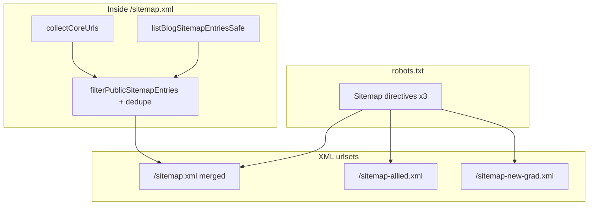
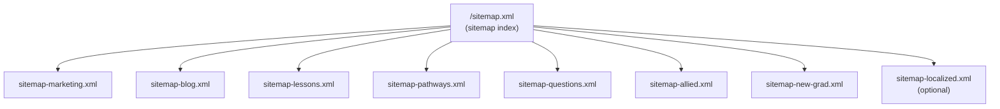
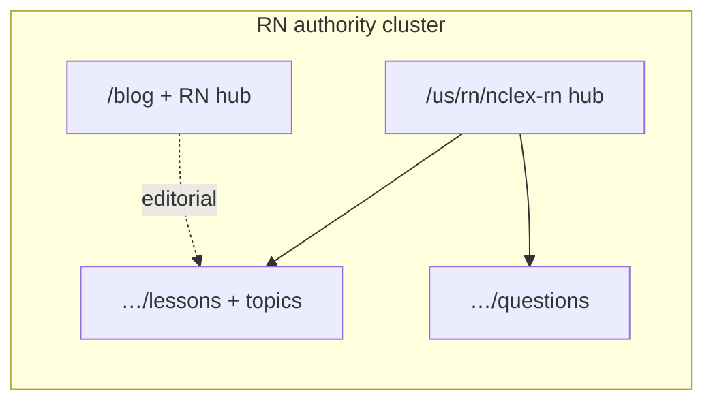

# NurseNest sitemap architecture — audit & roadmap

**Purpose:** Information architecture + discoverability + topical authority—not “SEO cleanup” alone.  
**Status:** Audit complete; **Phase 1** (segmented blog urlset) implemented. Further splits are roadmap-only unless prioritized.

**Figma:** This doc includes **Mermaid** diagrams you can paste into FigJam/Figma as the IA baseline; export PNGs for chat review per your workflow.

---

## Phase 1 implemented (repo)

- **`/sitemap-blog.xml`** — Blog-only urlset (`listBlogSitemapEntriesSafe` + `filterPublicSitemapEntries`). ETag + 304 like other routes (`src/app/sitemap-blog.xml/route.ts`).
- **`/sitemap.xml`** — Uses `excludeAbsoluteUrlsMatchingBlogSitemapEntries` so blog `<loc>`s are **not** duplicated in the main merged file (`src/lib/seo/sitemap-public-index-filter.ts`).
- **`robots.txt`** — Fourth `Sitemap:` line for `sitemap-blog.xml` (`CANONICAL_SITEMAP_LINES`).
- **Tests:** `sitemap-public-index-filter.test.ts`, `sitemap-merged-route.test.ts`, `robots-route-source.contract.test.ts`.

**Next phases:** Sitemap index at `/sitemap.xml`, further segmentation (lessons, pathways, localized), CI orphan validation — see risks/table above.

---

## Executive summary

| Area | Current state |
|------|----------------|
| **Primary merged urlset** | `/sitemap.xml` = `collectCoreUrls()` **minus** any `<loc>` also in blog urlset; blog posts/hub live in `/sitemap-blog.xml` |
| **Satellite urlsets** | `/sitemap-blog.xml`, `/sitemap-allied.xml`, `/sitemap-new-grad.xml` |
| **robots.txt** | **Four** `Sitemap:` lines — enforced in tests (`robots.txt/route.ts`) |
| **Gated surfaces** | `/app/*`, `/admin/*`, `/api/*`, `/seo/` — **disallowed** + excluded from urlsets via `isValidPublicUrl` |
| **Lessons** | Pathway lesson hubs, topic clusters, lesson detail URLs — DB-backed, **capped** (`MAX_PATHWAY_DERIVED_SITEMAP_URLS` = 48k) + time budget (`SITEMAP_PATHWAY_BUDGET_MS`) |
| **Blog** | Dedicated **`/sitemap-blog.xml`** (same rows as former merge slice); lastmod from publish rows |
| **ECG / labs / learner modules** | **Not** separately segmented; deep learner URLs generally **not** indexable |
| **OSCE / scenarios** | Marketing hub paths when feature flags on (`collectOsceScenariosMarketingHubUrls`) |

**Splitting into many urlsets** (your Part 2) is **architecturally aligned** with existing comments in `sitemap-static-xml.ts` (50k url cap / timeout mitigations) but requires a **sitemap index** at `/sitemap.xml`, updated **robots.txt** contract, and dedupe guarantees across segments.

---

## Part 1 — Inventory (what exists today)

### A. Sitemap routes (App Router)

| URL | Role |
|-----|------|
| `/sitemap.xml` | Marketing + pathway lessons + … **without** blog `<loc>` overlap (`src/app/sitemap.xml/route.ts`) |
| `/sitemap-blog.xml` | Blog hub + posts (`src/app/sitemap-blog.xml/route.ts`) |
| `/sitemap-allied.xml` | Allied occupation hubs (`collectAlliedMarketingUrls`) |
| `/sitemap-new-grad.xml` | New Grad marketing paths (`NEW_GRAD_MARKETING_SITEMAP_PATHS`) |

No `sitemap-blog.xml`, `sitemap-lessons.xml`, etc. **today**.

### B. Core merged `/sitemap.xml` composition (`collectCoreUrls`)

High-level buckets (see `src/lib/seo/sitemap-static-xml.ts`):

1. **Marketing base (default locale):** `/`, `/about`, `/question-bank`, `/practice-exams`, `/lessons`, `/pricing`, `/for-institutions`, `/blog`, `/faq`, legal/policy/contact pages, `/tools`, `/case-studies`, …
2. **Per-locale marketing:** `collectLocaleMarketingSitemapSafeUrls` for each locale in `getSitemapIncludedLocales()` (tier **full** only for listing).
3. **Programmatic question topics:** `/questions/{slug}` from registry (bounded).
4. **Expansion exam marketing paths:** `listPublishedExpansionExamMarketingPaths()`.
5. **Regional long-tail** (India, Middle East, AU, …) — gated by `isRegionalMarketingUrlPublished`.
6. **Exam pathway URLs:** `collectExamPathwayUrls` — each published pathway: hub, `pricing`, `questions`.
7. **NP practice test segments:** `collectNpPracticeTestHubUrls`.
8. **Pathway topic programmatic:** `collectPathwayTopicProgrammaticUrls`.
9. **Content-backed study resource hubs:** DB slice (capped).
10. **Programmatic study SEO pages:** `…/study/{lessonSlug}` (eligibility gate).
11. **Allied marketing URLs:** also in core (duplicate overlap with allied sitemap — dedupe by loc in route).
12. **Pre-nursing:** hub + lesson index + study plan + **module detail** URLs from registry.
13. **Pathway lessons:** index + per-pathway hub + topic clusters + lesson detail slugs (dominant volume).
14. **OSCE / clinical scenarios:** pathway `…/osce`, `…/clinical-scenarios` when flags allow.

**Blog:** `mergeCoreUrlsWithBlogEntries` adds `/blog`, posts, optional `/blog/rn` with lastmod.

### C. robots.txt policy (`src/app/robots.txt/route.ts`)

- `Disallow: /app/`, `/admin/`, `/internal/`, `/api/`, `/seo/`
- Locale **disabled** tiers: `Disallow: /{code}/`
- **Partial** tiers: crawl allowed; **not** listed in sitemap (noindex via metadata—see comments)
- **Three** fixed `Sitemap:` origins (`CANONICAL_PRODUCTION_ORIGIN`)

### D. hreflang / canonical (audit pointers)

- Shared localized marketing: `src/lib/seo/marketing-alternates.ts`
- Exam pathway hubs: `src/lib/seo/exam-pathway-hub-alternates.ts`
- Readiness matrix: `src/lib/seo/localized-seo-readiness.ts` (+ tests)

Sitemap emission does **not** embed hreflang; **page metadata** does. Splitting sitemaps must **not** drift canonical/hreflang rules.

---

## Part 2 — Gap vs desired segmented sitemaps

| Desired segment | Today | Notes |
|-----------------|-------|--------|
| `sitemap-marketing.xml` | Partially merged into core | Would extract static + locale + legal + core marketing |
| `sitemap-blog.xml` | Inside `/sitemap.xml` | Straight extraction from `listBlogSitemapEntriesSafe` |
| `sitemap-lessons.xml` | Inside `/sitemap.xml` | `collectPathwayLessonSeoUrls` + lesson hubs |
| `sitemap-questions.xml` | Partial (`/questions/*`, pathway `questions`) | Clarify overlap with pathway URLs |
| `sitemap-flashcards.xml` | Not isolated | Confirm **marketing** flashcard hub URLs exist and are indexable before emitting |
| `sitemap-ecg.xml` | Not typical | Public **marketing** ECG hubs vs `/modules/ecg` learner — **do not** index gated learner shells |
| `sitemap-labs.xml` | Same | Teaser/marketing only |
| `sitemap-pathways.xml` | Split across core | Exam hubs + programmatic topics |
| `sitemap-allied.xml` | **Exists** | Keep |
| `sitemap-localized.xml` | Mixed into core | Could isolate locale-prefixed URLs for ops clarity |
| Future: scenarios, medications, NGN | OSCE/scenarios partially in core | Add when public routes + governance OK |

**Recommendation:** Introduce **`/sitemap.xml` as sitemap index** listing child urlsets; keep **dedupe** global or enforce disjoint partition rules to avoid duplicate `<loc>` across files (search engines tolerate duplicates but IA clarity suffers).

---

## Part 3 — Educational SEO architecture (clustering)

**Strengthening topical authority** is primarily:

- **Internal linking** (hubs, breadcrumbs, related content)—not sitemap XML alone.
- **Consistent `/us|canada/{role}/{exam}/…` clusters** already emitted for published pathways.
- **Blog ↔ lessons:** distribution footer + cross-links; sitemap listing both **helps discovery** but **relationship** is HTML graph + schema.

**Action items (non-sitemap):**

- Editorial taxonomy tags aligning blog categories with pathway topic clusters.
- `BlogPosting` + lesson URLs in same pathway family where metadata allows.

---

## Part 4 — Blog + lesson ecosystem (connection)

| Mechanism | Location |
|-----------|----------|
| Post → lessons/tools | `BlogPostDistributionFooter`, publishing package fields |
| Lesson index → blog | Marketing cross-links, hub modules |
| Sitemap | Lists both URL families—**does not** encode graph edges |

**Roadmap:** Optional **`xsl` human preview** or internal admin “cluster view”—out of scope for XML alone.

---

## Part 5 — hreflang + canonical validation

**Existing tests:** `localized-seo-readiness.test.ts`, `exam-pathway-hub-alternates.test.ts`, sitemap merged route tests.

**Risks when splitting sitemaps:**

- Same canonical URL appearing twice across segment files (reduce trust signal noise)—mitigate with single-owner rule per URL.
- Locale **partial** routes listed in a segment while `noindex` — must align with `getSitemapIncludedLocales` + `filterPublicSitemapEntries`.

---

## Part 6 — Premium module discoverability policy

| Surface | Typical index stance |
|---------|----------------------|
| `/app/*` learner practice, CAT, flashcards session | **noindex / disallow** — do not add to sitemap |
| Marketing pathway hubs (`…/flashcards`, `…/practice-tests`, …) | **Index** only if route is **public marketing** + metadata `index` |
| ECG / labs **marketing** teasers | Index if **published** and not gated |
| OSCE / scenarios hubs | Already flag-gated in `collectOsceScenariosMarketingHubUrls` |

**Rule:** Every proposed `<loc>` must pass `isValidPublicUrl` + product **indexability** review—never leak entitlement-only URLs.

---

## Part 7 — Diagrams (for Figma / FigJam)

### A. Current crawler-facing map



### B. Target segmented architecture (proposal)



### C. RN ecosystem (conceptual clustering)



**Designer task:** Recreate in Figma/FigJam with NurseNest branding for stakeholder review.

---

## Part 8 — Testing & validation roadmap

| Check | Approach |
|-------|----------|
| Orphan pages | Diff sitemap `<loc>` set vs route registry / crawler inventory (script or CI job) |
| Missing canonical | Extend `localized-seo-readiness` coverage |
| Broken sitemap refs | HTTP GET smoke on each sitemap URL in staging |
| Duplicates | Assert global uniqueness across index + children |
| noindex vs indexed | Cross-check `safeGenerateMetadata` for surfacing in sitemap |
| Gated routes | Negative test: no `/app` loc passes filter |

**Existing:** `sitemap-merged-route.test.ts`, `sitemap-new-grad.contract.test.ts`, robots canonical line tests.

**Commands (after implementation):**

```bash
npm run typecheck:critical
# Target any SEO/sitemap unit tests
npm test -- src/lib/seo/sitemap
npm test -- src/app/robots.txt
```

Playwright: optional fetch of `/sitemap.xml` + child urlsets in smoke suite.

---

## Part 9 — Deliverables checklist

| # | Deliverable | Owner |
|---|-------------|--------|
| 1 | **This audit summary** | Done (repo) |
| 2 | Figma IA diagrams | Design — export PNG → chat |
| 3 | Proposed **segment list** + dedupe rules | Product + SEO |
| 4 | Risk register (duplicates, robots contract, build time) | Eng |
| 5 | **Implement** sitemap index + segments + robots update + tests | Eng PR |
| 6 | Final inventory report (URL counts per segment, sample logs) | Eng |

---

## Implementation notes (when approved)

1. Replace or wrap `/sitemap.xml` with **sitemap index** XML schema (`<sitemapindex>`).
2. Extract collectors into **pure functions** returning disjoint sets OR tag entries with **segment id** then partition (single source of truth).
3. Update `CANONICAL_SITEMAP_LINES` in `robots.txt` — **all** child sitemaps must be listed (or list **only** index if engines accept—typically **index + critical children** is redundant; **prefer single index line** + engines follow children).
4. Keep **fallback** behavior on DB failure (never 503 merged discovery).
5. Re-run blog + pathway caps per file after split.
6. Document **environment** knobs (`SITEMAP_PATHWAY_BUDGET_MS`, build-safe mode).

---

## Risks discovered

| Risk | Mitigation |
|------|------------|
| **robots.txt** hard-coded 3 lines | Changing to index-only or N lines requires **test updates** and deployment discipline |
| **Duplicate loc** across new files | Partition ownership; CI uniqueness assert |
| **Build/generation time** spikes | Parallel segment routes + caching ETags (already pattern) |
| **Accidental `/app` URLs** | Keep `filterPublicSitemapEntries` + manual review of new collectors |
| **Flashcards/CAT “hubs”** | Confirm **marketing** paths exist; do not point sitemap at learner shells |

---

## References (code)

- `src/app/sitemap.xml/route.ts`
- `src/lib/seo/sitemap-static-xml.ts` — `collectCoreUrls`, caps, comments on 50k split
- `src/lib/seo/sitemap-blog-xml.ts`
- `src/lib/seo/sitemap-public-index-filter.ts`
- `src/app/robots.txt/route.ts`
- `src/lib/seo/public-url-validator.ts`
- `src/lib/scenarios/scenario-marketing-sitemap-urls.ts`
