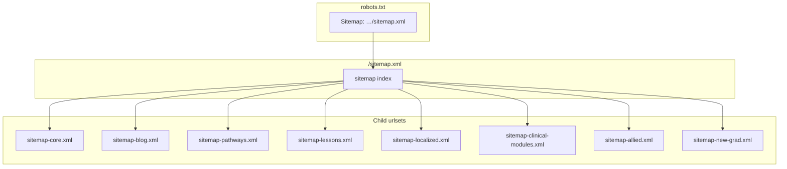
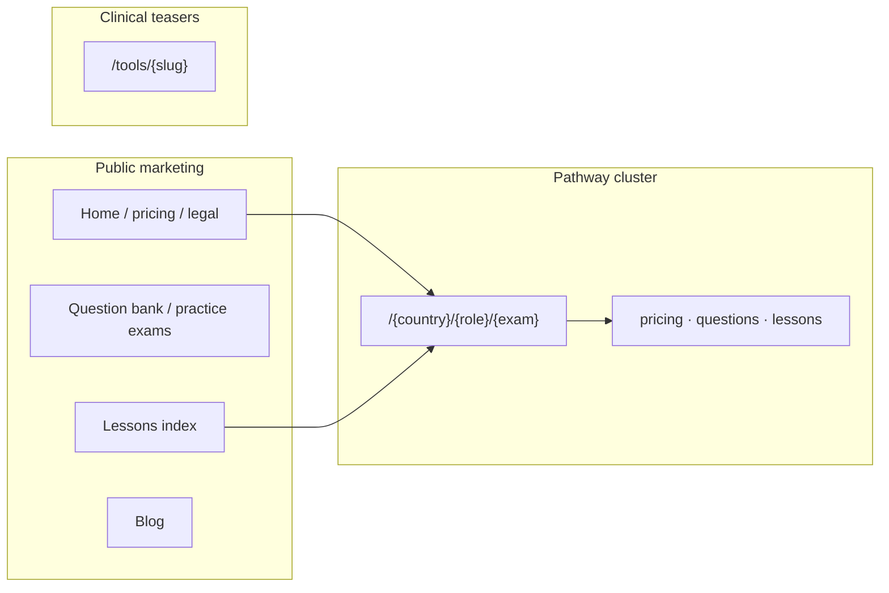
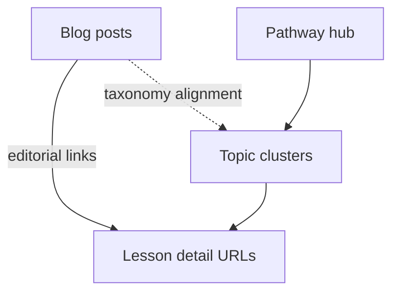
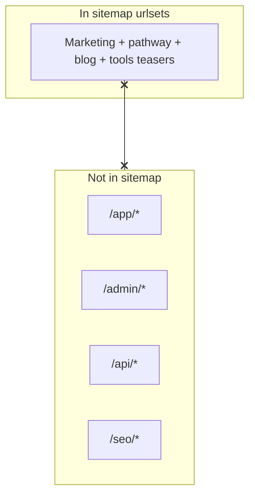
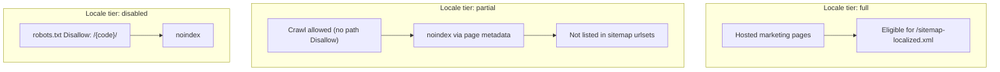

# Sitemap segmentation — final SEO evidence & Figma-ready IA (Phase 5)

**Purpose:** Single stakeholder-facing record of the **final segmented sitemap architecture**, SEO rules, and **information architecture** diagrams suitable for **FigJam / Figma** (Mermaid → paste → export).  
**Scope:** Documentation only — **no runtime, robots, canonical, hreflang, or route-rule changes** are implied by this file.

**Related:** `docs/planning/sitemap-architecture-audit-and-roadmap.md`, Phase 1–4 reports under `docs/reports/`, generated validator output `docs/reports/sitemap-segmentation-validation.md`.

---

## 1. Final sitemap index structure

`/sitemap.xml` is a **sitemap index** (`<sitemapindex>`). It lists **exactly eight** child urlsets in **stable order** (ETag / tests). Source of truth: `SITEMAP_INDEX_CHILD_FILENAMES` in `src/lib/seo/sitemap-index-children.ts`.

| # | Child filename | Purpose (summary) |
|---|----------------|---------------------|
| 1 | `sitemap-core.xml` | Default-locale marketing + programmatic URLs from `collectCoreUrls` with pathway lessons, localized marketing, and exam-pathway hub URLs **partitioned out**; blog rows stripped via `excludeAbsoluteUrlsMatchingBlogSitemapEntries`; overlaps with pathway hubs removed vs `collectExamPathwayUrls` where applicable. |
| 2 | `sitemap-blog.xml` | Blog hub, categories, and posts (`listBlogSitemapEntriesSafe` + public filter). |
| 3 | `sitemap-pathways.xml` | Exam pathway hubs, pricing/questions surfaces, programmatic pathway topics, pathway lesson **hubs + topic clusters** (`collectPathwaysSegmentUrls`). |
| 4 | `sitemap-lessons.xml` | Pathway lesson **detail** URLs (lesson-detail segment). |
| 5 | `sitemap-localized.xml` | Tier-**full** locale-prefixed marketing URLs only (`collectLocalizedMarketingSegmentUrls`). |
| 6 | `sitemap-clinical-modules.xml` | Public clinical **marketing** teasers (e.g. `/tools/*`) + OSCE/clinical-scenario **marketing** hubs when flags allow. |
| 7 | `sitemap-allied.xml` | Allied health marketing hubs (`collectAlliedMarketingUrls`). |
| 8 | `sitemap-new-grad.xml` | New Grad marketing paths (`collectNewGradMarketingUrls` / `NEW_GRAD_MARKETING_SITEMAP_PATHS`). |

**robots.txt** declares **one** `Sitemap:` line → canonical origin + `/sitemap.xml` (index only). Crawlers discover children via index `<loc>` entries — see §4.

---

## 2. URL counts per segment (evidence, environment-dependent)

Counts come from the **Phase 4 offline validator** (`npm run sitemap:validate` / `npm run sitemap:report`), which invokes the same App Router `GET` handlers as production. Totals **vary** with database availability, feature flags, pathway budgets (`SITEMAP_PATHWAY_BUDGET_MS`), and safe/skip build modes.

**Rolling snapshot:** See **`docs/reports/sitemap-segmentation-validation.md`** (regenerated by `npm run sitemap:report`).

| Segment file | Role label |
|--------------|------------|
| `sitemap-core.xml` | core |
| `sitemap-blog.xml` | blog |
| `sitemap-pathways.xml` | pathways |
| `sitemap-lessons.xml` | lessons |
| `sitemap-localized.xml` | localized |
| `sitemap-clinical-modules.xml` | clinical-modules |
| `sitemap-allied.xml` | allied |
| `sitemap-new-grad.xml` | new-grad |

**Operational caps:** Segment urlsets stay **under ~50k URLs** per file; validator warns near **40k** and fails at **48k** (`src/lib/seo/sitemap-segment-validator.ts`).

---

## 3. robots.txt strategy

Implementation: `src/app/robots.txt/route.ts`.

| Mechanism | Behavior |
|-----------|----------|
| **Sitemap discovery** | Exactly **one** line: `Sitemap: https://www.nursenest.ca/sitemap.xml` (production canonical origin). |
| **Learner / internal** | `Disallow: /app/`, `/admin/`, `/internal/`, `/api/`. |
| **SEO rewrite surface** | `Disallow: /seo/` — avoids duplicate indexing with public `/{slug}` programmatic routes. |
| **Incomplete locales** | Per-language `Disallow: /{code}/` when locale tier is **disabled**. |
| **Partial locales** | Crawling **allowed**; pages use **noindex** via metadata; URLs **not** listed in sitemap for partial tiers (route comments). |

---

## 4. Private route exclusion rules (sitemap + validation)

| Layer | Responsibility |
|-------|----------------|
| **`isValidPublicUrl`** | HTTPS, correct origin, no query/hash, blocked prefixes `/app`, `/admin`, `/api`, `/seo/`, … (`src/lib/seo/public-url-validator.ts`). |
| **`filterPublicSitemapEntries`** | Drops failing URLs + auth noindex marketing paths (`src/lib/seo/sitemap-public-index-filter.ts`). |
| **`isEligiblePublicIndexSitemapLoc`** | Auth noindex guard (`src/lib/seo/sitemap-marketing-exclusions.ts`). |
| **Phase 4 validator** | Offline regression: forbidden paths, duplicates across segments, XML validity (`src/lib/seo/sitemap-segment-validator.ts`). |

---

## 5. noindex vs indexability (marketing locales)

| Locale tier | Crawling | Typical `robots` meta | In sitemap urlsets |
|-------------|----------|------------------------|---------------------|
| **full** | Allowed | indexable where page metadata allows | Tier-full `/{locale}/…` may appear in **`/sitemap-localized.xml`** |
| **partial** | Allowed (no path Disallow) | **noindex** | **Not** listed |
| **disabled** | Path disallowed in robots.txt | noindex | **Not** listed |

---

## 6. Canonical strategy

- Sitemaps list URLs only; **canonical tags are per-page** (`generateMetadata` / layout conventions).
- Production origin: `resolveCanonicalSiteOrigin()` / `CANONICAL_PRODUCTION_ORIGIN` (`src/lib/seo/canonical-site.ts`).
- Segmented sitemaps **must not** change page canonical rules.

---

## 7. hreflang strategy

- **hreflang is not embedded in sitemap XML.**
- Alternates live in **page metadata** and helpers: `marketing-alternates.ts`, `exam-pathway-hub-alternates.ts`, `localized-seo-readiness.ts`.

---

## 8. Breadcrumb coverage expectations

Implementation hub: `src/lib/seo/breadcrumb-resolver.ts`, `breadcrumb-types.ts`, `breadcrumb-i18n.ts`.

| Surface | Expectation |
|---------|-------------|
| **Marketing shell** | Home → section → page. |
| **Pathway hubs** | Country / role / exam context. |
| **Lesson pages** | Pathway + lessons + topic + lesson. |
| **Blog posts** | Blog → post; editorial links to lessons/tools where set. |
| **Allied / New Grad** | Program hub hierarchy. |
| **Clinical teasers** | `/tools` → `/tools/{slug}` where applicable. |
| **Localized** | Locale root + translated crumb labels. |

---

## 9. Blog → lesson → practice / CAT / flashcard ecosystem

- Sitemap lists blog + lesson families as **parallel discovery** — **edges** are HTML internal links (`BlogPostDistributionFooter`, related reading), not XML.
- Learner `/app/*` surfaces stay **disallowed** and **out of sitemaps**; marketing hubs may link into gated flows per metadata.

---

## 10. Excluded future segments (roadmap backlog)

| Segment | Rationale |
|---------|-----------|
| **`sitemap-marketing.xml`** | Partitioned across **core** + **localized**. |
| **`sitemap-questions.xml`** | Overlap with pathway `questions` + `/questions/*` — needs partition rules. |
| **`sitemap-flashcards.xml`** | Only with indexable **marketing** hubs; not learner `/app/flashcards`. |
| **`sitemap-ecg.xml` / `sitemap-labs.xml`** | Avoid conflating teasers vs learner modules; clinical teasers use **`sitemap-clinical-modules.xml`**. |
| **Standalone NGN / medications** | Needs approved public routes + governance. |

---

## 11. Figma-ready IA — Mermaid diagrams

### 11.1 Sitemap index



### 11.2 Public route taxonomy



### 11.3 Blog / lesson / topic authority cluster



### 11.4 Gated vs public



### 11.5 Localized sitemap readiness



---

## 12. Breadcrumb audit checklist

| Surface | Check |
|---------|------|
| **Marketing pages** | Home + section crumbs; last crumb matches page. |
| **Pathway hubs** | Country / role / exam context; links to lessons/questions coherent. |
| **Lesson pages** | Pathway → lessons → topic → lesson trail matches navigation. |
| **Blog posts** | Blog index → post; related lesson links when editorially present. |
| **Allied pages** | Allied IA; no `/app` in crumbs. |
| **New Grad pages** | Region + work-area hierarchy. |
| **Clinical teasers** | `/tools` → tool; no gated `/modules` or `/app/labs` in crumbs unless explicitly marketing. |
| **Localized pages** | Locale root; translated labels; partial locales still coherent UI with noindex. |

---

## 13. Evidence refresh

```bash
npm run typecheck:critical
npm run sitemap:validate
npm run sitemap:report
```

---

## 14. Remaining SEO follow-ups

1. HTTP smoke (`verify:sitemap`) on staging/production for status/redirects.
2. Periodic orphan diff vs GSC.
3. Future segments only after public routes + partition rules.
4. Figma frames vs `breadcrumb-types` when new shells ship.

---

*Phase 5 — documentation only; no code changes in this deliverable.*
