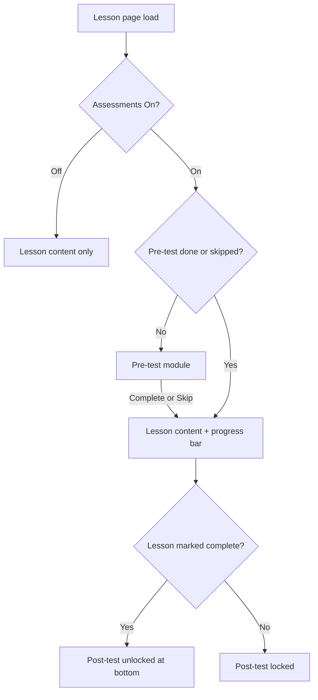

# RN Lesson Pre/Post Assessment — Design Spec

**Status:** Design mockups — `rn-lesson-pre-post-assessment-design.html`  
**PNG exports:** `lesson-mockups/exports/lesson-pre-post/`

---

## Flow

---

## Shared assessment layout (pre and post use identical chrome)

| Element | Pre-test | Post-test |
|---------|----------|-----------|
| Eyebrow | `PRE-TEST · READINESS` | `POST-TEST · RETENTION` |
| Title | Quick Readiness Check | Retention Check |
| Accent | Info blue | Success green |
| Question UI | Same card stack, A–D options, SATA label when needed |
| Progress | Question N of M + submit bar | Same |
| Report card | Score saved to lesson diagnostics on complete | Same + optional growth vs pre |

---

## Requirements

- **5–10 questions** per assessment (mock uses 8 on Pulmonary Embolism)
- **Toggle** On/Off persists; Off skips straight to lesson
- **Pre** renders **before** lesson body; lesson hidden until complete or skip
- **Post** at **bottom** of page; locked until lesson marked studied/complete
- Scores count toward **report card** / learner lesson assessment API (existing `LessonAssessmentFlow`)

---

## Implementation note

Wire into existing `LessonAssessmentFlow`, `LessonPreAssessmentCard`, `LessonPostAssessmentCard`, and v2.7 `LessonReadingViewport` shell — mockups are presentation reference only.
