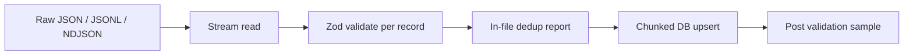

# Content import pipeline (lessons + question banks)

Design for **safe, chunked, deduplicated** ingestion aligned with `docs/CONTENT_STORAGE_ARCHITECTURE.md`.

**Ops:** build vs migrate vs import, memory, and CI checks — `docs/OPERATOR_DATA_IMPORT_AND_BUILD.md`.

## Pipeline stages



1. **Acquire:** file from Spaces signed URL, CI artifact, or stdin (never commit multi‑MB banks to `main`).
2. **Validate:** `npm run content:validate-questions-jsonl -- <file>` (or library API for custom runners).
3. **Stage (optional):** write `DRAFT` / `IN_REVIEW` rows only; publish in a second step after QA.
4. **Publish:** flip `status` to `published` with editorial policy checks (questions) or pathway gates (lessons).
5. **Verify:** spot-check counts + `stemHash` collision queries per batch slice.

## Import run manifest (required for production-grade traceability)

Every orchestrated ingestion should record a **`content_import_runs`** row:

1. **`startContentImportRun`** at job start (`src/lib/content-pipeline/content-import-run.ts`) with `sourceKind`, optional `manifest` (paths, flags, slice keys — no secrets), and optional `inputSha256`.
2. **`finishContentImportRun`** on success or failure with `report` / `stats` / `errorMessage`.

When you need **rollback**, archive live rows **before** overwrite using **`archiveExamQuestionRevision`** / **`archivePathwayLessonRevision`** / **`archiveContentItemRevision`** (`src/lib/content-pipeline/content-revision.ts`). See **`docs/CONTENT_VERSIONING.md`**.

## Chunked ingestion

- Read **one line / one object at a time** for JSONL; for large single JSON arrays, use a streaming parser or split files upstream.
- **Constants:** `IMPORT_VALIDATE_CHUNK`, `IMPORT_DB_UPSERT_CHUNK`, `IMPORT_BATCH_MAX_LINES` in `src/lib/content-pipeline/import-safeguards.ts`.
- **Resumability:** persist `{ file, lineOffset, lastOkId }` to a checkpoint file (gitignored); on retry, skip lines until offset.

## Deduplication during import

- **Questions:** primary insert key is `id` if provided (UUID); else generate. Before insert without id, query `stemHash` **scoped** by `exam` + `tier` + `countryCode` (indexed).
- **Pathway lessons:** `upsert` on `(pathwayId, slug, locale)`.

## Validation rules (summary)

| Stage | Rule |
|-------|------|
| Schema | Required fields present; enums match DB expectations; JSON fields are arrays/objects |
| Editorial | For `published`, run `governExamQuestionPublish` (questions) or pathway structural/premium validators |
| Safety | No `stem` / `rationale` empty for publish; image URLs must be `https:` if present |
| Size | Single record stem + rationale bounded (reject absurdly large rows before DB) |

Full Zod shapes: `src/lib/content-pipeline/schemas/`.

## Publish / unpublish workflow

| Action | Implementation |
|--------|----------------|
| Publish | Set `status` → `published`, set `publishedAt` / `publishAt` as applicable |
| Unpublish | Set → `draft` or `in_review`; keep row |
| Retire | Set → `archived` (preferred over delete for analytics) |

## Archive strategy

- **Retired content:** `ARCHIVED` status; exclude from learner `WHERE` clauses; keep for history.
- **Retired imports:** keep batch metadata in ops logs; DB rows remain unless legal requires deletion (then soft-delete pattern with anonymized ids—product decision).

## Operational safeguards

- **Memory:** never `JSON.parse` entire 100MB file; stream.
- **DB:** batched transactions; avoid `findMany` without `take` on import paths.
- **Concurrency:** single writer per pathway or exam slice per environment to avoid lock storms.
- **Rollback:** revert status + re-import previous snapshot from last known-good file (stored in Spaces with versioned key).

## Rollout plan (low risk)

| Phase | Scope | Risk |
|-------|--------|------|
| **0** | Docs + `content-pipeline` library + JSONL validator (this deliverable) | None |
| **1** | New imports use validator in CI; existing DB untouched | Low |
| **2** | Pathway pathways with DB rows: stop editing `catalog.json` for those ids; DB-only | Medium—coordinate content |
| **3** | Replace static `import catalog.json` with DB-only or lazy server load for remaining pathways | Medium—requires perf testing |
| **4** | Optional `content_import_batches` table for audit | Low once schema agreed |

## CLI

```bash
# Validate a JSONL file (one JSON object per line)
npm run content:validate-questions-jsonl -- path/to/questions.jsonl
```

Exit code `0` when all lines valid and duplicate stems within file reported as warnings only (configurable).

## Legacy TypeScript imports (`scripts/import-legacy-client-*.mts`)

These read `client/src/data/**` sources and write to Postgres.

| Guard | Behavior |
|-------|----------|
| **Bounded file read** | `assertSourceFileBounded()` — refuses files larger than 64 MiB (override: `import-fs-guards.mts`) |
| **Live write ack** | `--confirm-write` or `IMPORT_CONFIRM_WRITE=1` |
| **Cloud DB** | Hosts like `*.neon.tech`, `*.supabase.co`, `*.amazonaws.com` require `IMPORT_ACK_PRODUCTIONISH_DATABASE=I_UNDERSTAND` or `IMPORT_ALLOW_PRODUCTION_DATABASE=1` |
| **Batch size** | Question rows use `IMPORT_DB_UPSERT_CHUNK` (100); flashcards use `IMPORT_FLASHCARD_TX_BATCH` (40) per transaction |
| **Dedup** | Exam questions: `(stemHash, exam, tier, countryCode)` via `import-exam-question-dedupe.mts` — not stem-only |
| **Strict country** | `IMPORT_STRICT_SCOPE=1` rejects normalized rows whose `countryCode` ≠ file default (`US` for these scripts) |
| **Resume** | `--resume` skips files listed in `data/import-checkpoints/*.json` (gitignored) and appends completed files when `--resume` is set |
| **Logs** | `import-safe-log.mts` — counts and filenames only, no stems |
