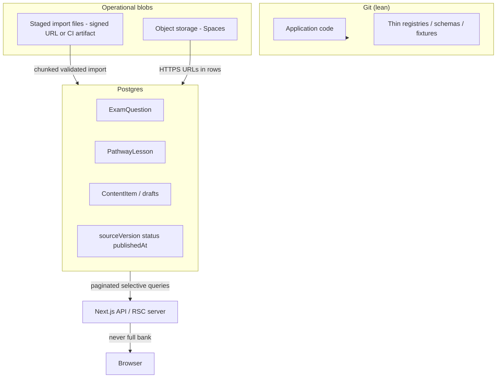

# Content storage architecture (lessons + question banks)

Senior-level target model for **large education content**: safe for production, maintainable for a team, and aligned with existing NurseNest patterns (Postgres + Spaces + server-only loaders).

## 1) Current pattern (as implemented today)

| Asset class | Primary runtime store | Secondary / fallback | Risk notes |
|-------------|----------------------|----------------------|------------|
| **Exam questions** | Postgres `ExamQuestion` | Legacy JSON under `server/`, `data/materialized/` used by **offline** tooling—not learner runtime | Good: APIs paginate; **bad** if new bulk JSON lands in `public/` or client imports |
| **Pathway marketing lessons** | Postgres `PathwayLesson` when rows exist | **`src/content/pathway-lessons/*.json`** merged in `pathway-lesson-catalog-sync.ts` | Catalog JSON is **`import`‑bundled** into server chunks → **build bloat** and **full catalog in memory** on cold paths |
| **Legacy RN lessons (`ContentItem`)** | Postgres `content_items` | N/A | Follow same import/validation rules as pathway lessons for consistency |
| **Media** | Spaces URLs in JSON / DB fields | `public/` only for small, reviewed static assets | See `docs/storage-strategy.md` and `docs/OBJECT_STORAGE_STRATEGY.md` |
| **i18n overlays** | DB + compile pipeline | `public/i18n/*.json` | Already governed separately; do not duplicate lesson bodies there |

**Freemium vs premium (questions):** enforced in SQL/API via `tier`, `exam`, `countryCode`, `status`, and helpers in `src/lib/questions/exam-question-access-sql.ts` + entitlements—not by storing two copies of the same stem.

**Paid lesson text:** server render + entitlement checks; repo confidentiality is **organizational** (see `docs/pathway-lesson-catalog-security.md`).

---

## 2) Target architecture (source of truth)

**Canonical rule:** **Postgres holds authoritative text + metadata** for anything learners or SEO surfaces touch at scale. **Spaces** holds bytes (images, future PDFs/audio). **Git** holds code, **validation schemas**, small **fixtures**, and **documentation**—not production-scale JSON corpora.

---

## 3) What stays source-controlled vs moves out

| Stay in Git | Move out of Git (SoT = DB + Spaces) |
|-------------|-------------------------------------|
| Zod/TS types, import validators (`src/lib/content-pipeline/*`) | Full question banks and large lesson bodies at steady state |
| Pathway **registry** (allowed pathway ids, launch metadata) if kept tiny | Per-lesson JSON dumps used for bulk refresh |
| Smoke fixtures (`tests/fixtures/…`) | Replit / export blobs (use `replit-export/` prefix in Spaces per `storage-strategy.md`) |
| Compiled i18n **process** (`tools/i18n/`) | Generated reports (`reports/*.json`) — already ignored where applicable |

**Pathway lessons:** target state is **DB-first for every published pathway**, with `catalog.json` shrunk to **emergency fallback** or removed after parity. Until then, treat catalog edits as **deploy-time debt** and prefer DB promotion for new work.

---

## 4) Stable identifiers

| Entity | Stable key | Notes |
|--------|------------|--------|
| Pathway lesson | `(pathwayId, slug, locale)` | DB `@@unique`; see `stablePathwayLessonKey()` in code |
| Exam question | **Primary:** `id` (UUID). **Dedup:** `stemHash` + exam/tier/country scope | `stemHash` is non-cryptographic; collisions possible—resolve with human review |
| Flashcard | `stableKey` column (`{sourceType}:{sourceId}`) | See Prisma `Flashcard` model |

Implementation: `src/lib/content-pipeline/stable-ids.ts`.

**Versioning, import manifests, rollback:** `docs/CONTENT_VERSIONING.md` — `sourceVersion` / `contentVersion`, `content_import_runs`, `content_entity_revisions`, integrity hashes.

---

## 5) Deduplication strategy

1. **Questions:** compute `stemHash(stem)` (`src/lib/content/stem-hash.ts`). Before insert, query `exam_questions` for conflicting rows in the same **exam + tier + country** slice (narrow `WHERE`—never load full table).
2. **Pathway lessons:** upsert on `(pathwayId, slug, locale)`; merge sections only inside a transaction or single upsert.
3. **Cross-pipeline:** same stem in different exams is **not** a duplicate; include `exam` in the natural key for duplicate reporting.

Implementation: `src/lib/content-pipeline/deduplication-strategy.ts`.

---

## 6) Versioning, publish, rollback, archive

| Mechanism | Use |
|-----------|-----|
| `sourceVersion` (questions / content items) | Bump on meaningful editorial changes; audit scripts can compare |
| `status` + `publishedAt` / `publishAt` | **DRAFT → IN_REVIEW → PUBLISHED**; exam questions use string status via `contentStatusToDb` |
| **Rollback** | Prefer **status flip** (PUBLISHED → DRAFT or ARCHIVED) + optional **restore previous JSON snapshot** from an import batch record (see pipeline doc). Avoid destructive deletes for published rows |
| **ARCHIVED** | `ContentStatus.ARCHIVED` for retired lessons/cards; keep row for referential integrity and analytics |

**Future (optional):** `content_import_batches` table for audit (batch id, sha256, row counts, actor)—add when imports become frequent enough to justify a migration.

---

## 7) Validation before publish

1. **Schema validation:** Zod records in `src/lib/content-pipeline/schemas/*` (import shape).
2. **Editorial policy:** reuse `governExamQuestionPublish` / pathway structural gates before setting PUBLISHED.
3. **CI:** run `npm run content:validate-questions-jsonl` on candidate JSONL before merge to import branch.

---

## 8) Country / tier / exam separation

- **Persist** `countryCode`, `tier` / `tierCode`, `exam`, `regionScope`, `languageCode` on rows—**do not** infer only from tags.
- **APIs** compose `WHERE` clauses (see `exam-question-access-sql.ts`) so freemium queries **cannot** return premium-only fields by omission (subscriber routes add columns).

---

## 9) Runtime bundle and memory safeguards

- **No** `import giant.json` for production pathways—migrate to DB or **dynamic `fs` reads in Node scripts only** (not in Next client graph).
- **Admin routes:** keep `page` / `pageSize` caps (already on `/api/admin/questions`).
- **Imports:** stream JSONL; validate in chunks (`IMPORT_VALIDATE_CHUNK` in `import-safeguards.ts`); upsert in transactions of `IMPORT_DB_UPSERT_CHUNK` rows.

---

## 10) Operational safeguards (large imports)

- **Chunk size caps** and **line limits** per run (see `import-safeguards.ts`).
- **Idempotent upserts** keyed by stable ids.
- **Dry-run mode** for scripts (validate only, no DB writes)—pattern in `docs/CONTENT_IMPORT_PIPELINE.md`.
- **Checkpoint files** for resumable jobs (cursor + batch index) stored under `tmp/` or ops bucket—not committed.

---

## Related

- Import pipeline detail: `docs/CONTENT_IMPORT_PIPELINE.md`
- Workflows by content type: `docs/CONTENT_WORKFLOWS.md`
- Spaces + Postgres: `docs/storage-strategy.md`, `docs/OBJECT_STORAGE_STRATEGY.md`
- RN lesson library safety: `.cursor/rules/rn-lesson-library-safety.mdc`
