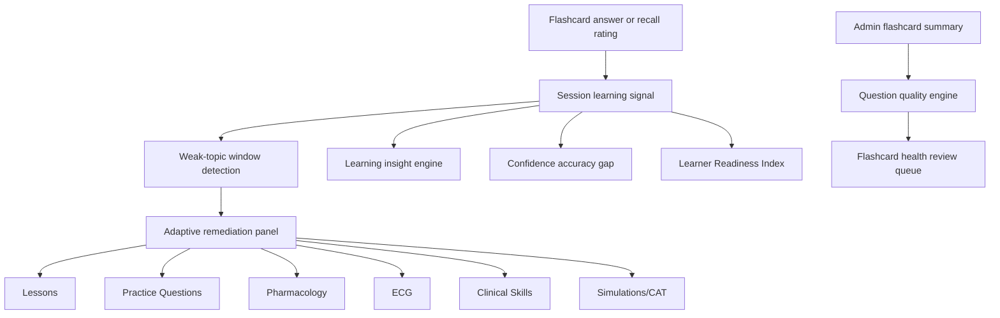

# Flashcards 2.1 Adaptive Learning, Remediation, and Learner Intelligence

## Scope

Flashcards 2.1 connects the existing flashcard study flow to NurseNest remediation, related learning, learner insight, and question-quality intelligence. This pass does not redesign the flashcard interface and does not create a second scoring engine.

## Architecture

## Implemented Components

- `src/components/flashcards/adaptive-remediation-panel.tsx`
  - Now presents “Strengthen this topic” after incorrect answers.
  - Uses concrete links only; no placeholder activities or dead-link shells.

- `src/lib/flashcards/related-learning-engine.ts`
  - Wraps the existing ecosystem resolver.
  - Maps flashcards to lessons, questions, flashcards, pharmacology, ECG, clinical skills, simulations, and CAT links when available.

- `src/lib/flashcards/learning-insight-engine.ts`
  - Tracks session-local accuracy, confidence, response ratings, weak-topic windows, professional streak summaries, confidence gap, recommended next steps, and Learner Readiness Index.
  - The index is educational only and does not predict licensing outcomes.

- `src/lib/flashcards/question-quality-engine.ts`
  - Scores flashcards using rationale depth, generic phrase detection, distractor rationale quality, response patterns, abandonment, and confidence mismatch signals.
  - Produces a review queue for admin follow-up.

- `src/components/study/active-study-session.tsx`
  - Records learning signals when learners rate cards.
  - Updates remediation state based on actual answer correctness when available.
  - Shows subtle learning insights, confidence checks, professional study streak counts, readiness index, and next-step guidance inside the existing coach panel.

- `src/app/api/admin/flashcards/summary/route.ts`
  - Adds real flashcard health metrics and a quality review queue sample to the existing admin summary endpoint.

- `src/components/admin/flashcards/admin-flashcard-list-client.tsx`
  - Adds Flashcard Health cards and a question-quality review queue to the existing admin flashcard list.

## Database Schema

No Prisma schema change was required for this pass. The implementation reuses existing persistence:

- `FlashcardAttempt`
- `FlashcardOptionResponse`
- `FlashcardProgress`
- `FlashcardSession`
- `FlashcardMastery`
- `FlashcardUserStats`

This preserves existing activity startup behavior and avoids introducing a parallel analytics store. Future persistence can promote session-local signals into an aggregate table without changing the learner-facing flow.

## Adaptive Rules

- Weak-topic detection evaluates recent windows of 5, 10, and 25 attempts.
- Remediation triggers when recent accuracy falls below threshold, confidence is repeatedly low, or Again/Hard ratings repeat.
- Confidence coaching distinguishes:
  - confident but incorrect patterns
  - correct but low-confidence patterns
- Recommendation copy is supportive and avoids shame language.

## Learner Journey

Before:

1. Learner answers a flashcard.
2. Learner sees correct/incorrect and rationale.
3. Learner rates recall.

After:

1. Learner answers a flashcard.
2. Learner sees contextual result feedback.
3. Learner reviews rationale.
4. Incorrect answers show topic-specific remediation links.
5. Coach panel shows learning insight, confidence gap, professional streak counts, and next recommended action as enough signals accumulate.

## Admin Journey

Admins can open `/admin/flashcards` and see:

- published card volume
- recent sessions
- recent attempts
- critical quality flag count
- review queue sample with links to edit flagged flashcards

## Validation

Unit coverage added in:

- `src/lib/flashcards/flashcards-2-1-intelligence.test.ts`

Coverage includes:

- weak-topic window detection
- learning insight generation
- confidence analytics
- professional streak summaries
- readiness index bounds and wording safety
- related-learning link resolution
- question-quality flagging and review queue ordering

