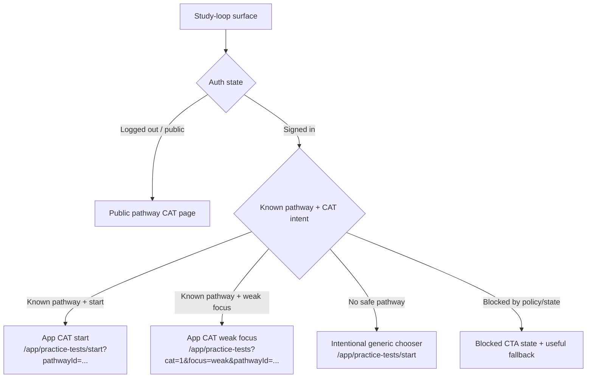

# refactor: Normalize study-loop CAT routing

## Overview

Normalize every CAT-related study-loop CTA so NurseNest uses one default routing rule everywhere: signed-in learners with a known pathway go directly to an app CAT entry that carries an explicit `pathwayId`, while logged-out or public-entry surfaces continue to use the public pathway CAT page. This pass is limited to study-loop routing, labeling, blocked states, analytics, and QA; it must not redesign CAT scoring, eligibility, or the broader exam system.

## Problem Frame

The public pathway CAT work is already in place, but study-loop surfaces still drift in a few ways:

- some authenticated surfaces still fall back to bare `/app/practice-tests/start`
- some weak-area flows use generic weak-mode builder URLs instead of CAT-explicit weak-focus URLs
- some legacy or recommendation surfaces can show CAT-like labels while landing on generic or ambiguous destinations
- analytics for CAT CTA clicks are uneven across lessons, recommendations, weak-area surfaces, and results follow-up flows

The result is a study loop that is mostly correct on public entry points but still inconsistent once a learner moves between lessons, rationales, dashboards, and weak-area remediation inside the app. This plan tightens those seams while preserving the existing public CAT page, server-side CAT gating, and post-sign-in return behavior already normalized in `nursenest-core/docs/cat-entrypoint-normalization-2026-04-10.md`.

## Requirements Trace

- R1. Audit and classify all CAT-related study-loop CTAs, helpers, and route builders across lessons, rationales, dashboards, weak areas, recommendations, empty states, and legacy helpers.
- R2. Signed-in + known pathway CAT CTAs must route directly to app CAT starts or the CAT weak-focus builder with explicit `pathwayId`.
- R3. Logged-out / marketing / public-entry CAT CTAs must continue to use the public pathway CAT page.
- R4. Generic CAT destinations may remain only where the surface is intentionally generic and labeled honestly.
- R5. CAT-branded weak-area and recommendation flows must not silently degrade into non-CAT weak-mode builders when pathway context is known.
- R6. Blocked or unavailable CAT states must remain calm, helpful, and consistent with lesson/question-bank fallback behavior.
- R7. CAT CTA analytics must use a shared contract that captures source surface, pathway context, destination kind, and blocked/allowed outcomes.
- R8. Representative browser QA must cover lesson, rationale/results follow-up, weak areas, dashboard, recommendations, and blocked CAT flows across multiple pathways.
- R9. Existing correct behavior must remain intact: public pathway CAT URLs, marketing eligibility checks, sign-in return-to-same-path behavior, structured `CAT_*` server reason codes, and type-safe pathway helpers.

## Scope Boundaries

- Do not redesign CAT scoring, session creation, or exam selection UX beyond routing and labeling needed for this normalization pass.
- Do not replace the public `/{country}/{role}/{exam}/cat` page for anonymous users.
- Do not remove server-side eligibility checks or `POST /api/practice-tests` revalidation.
- Do not broaden this work into unrelated dashboard, lesson-library, or premium UX redesign.
- Do not convert intentionally generic history/archive surfaces into pathway-specific flows unless the destination itself is meant to be pathway-specific.

## Context & Research

### Relevant Code and Patterns

- `nursenest-core/src/lib/exam-pathways/pathway-cat-flow.ts`
  Canonical signed-in CAT URLs: `appPathwayCatSessionStartPath(pathwayId)` and `appCatWeakFocusPath(pathwayId, topic?)`.
- `nursenest-core/src/lib/exam-pathways/practice-exams-cat-start.ts`
  Canonical public pathway CAT helpers and login-callback helpers for public CAT entry.
- `nursenest-core/src/lib/exam-pathways/exam-product-registry.ts`
  Canonical pathway-aware public route builder via `buildExamPathwayPath(pathway, "cat")`.
- `nursenest-core/src/lib/exam-pathways/cat-eligibility.ts`
  Existing marketing/app CAT eligibility and fallback contract that must stay authoritative for UX.
- `nursenest-core/src/components/lessons/pathway-lesson-link-practice.tsx`
  Current lesson study-loop CAT helper logic and one deprecated generic fallback seam.
- `nursenest-core/src/components/lessons/pathway-lesson-study-loop-cta.tsx`
  Canonical lesson-end study loop on public surfaces.
- `nursenest-core/src/lib/learner/recommend-next-actions.ts`
  Existing weak-pool CAT recommendation pattern using `appCatWeakFocusPath`.
- `nursenest-core/src/lib/learner/remediation-links.ts`
  Current split between weak-mode builder URLs and CAT-explicit weak-focus URLs.
- `nursenest-core/src/components/student/dashboard/learner-dashboard-analytics.tsx`
  Current preferred-pathway vs generic CAT quick-action resolution.
- `nursenest-core/src/components/student/dashboard/quick-action-panel.tsx`
  Existing dashboard CAT card consumes a single guided href and labels scoped vs generic states.
- `nursenest-core/src/components/student/practice-test-results-static.tsx`
  Results-page weak follow-up links currently mix weak-mode retest and direct CAT same-pathway start.
- `nursenest-core/src/components/student/cat-results-coach-panel.tsx`
  Existing CAT coach link analytics and safe internal link filtering.
- `nursenest-core/src/lib/practice-tests/cat-practice-fallbacks.ts`
  Internal-link safety filter that any new CAT hrefs must remain compatible with.
- `nursenest-core/src/lib/observability/posthog-conversion-events.ts`
  Central event-name registry; currently lacks a dedicated shared CAT study-loop CTA event and does not classify `/app/practice-tests` in `appSectionFromPathname`.

### Institutional Learnings

- `nursenest-core/docs/cat-entrypoint-normalization-2026-04-10.md`
  Existing audit confirms the public/app CAT split, insists on defense in depth (`cat-eligibility` plus `POST /api/practice-tests`), and already documents several normalized entry points that this plan must preserve.
- `nursenest-core/docs/pathway-hub-architecture.md`
  Reinforces the marketing/app split and the expectation that routing helpers stay centralized instead of being rebuilt ad hoc in components.
- `nursenest-core/docs/cat-premium-implementation-plan.md`
  Shows that CAT study-next and rationale follow-up behavior should extend existing coach/remediation pipelines rather than inventing separate recommendation stores.
- `nursenest-core/docs/qa-lesson-flows.md`
  Existing QA patterns already validate auth callback safety and pathway-safe lesson flows; this plan should extend those rather than invent a separate browser-QA style.
- `nursenest-core/docs/internal-link-audit.md`
  Internal href and `callbackUrl` strings are audited, so new shared helpers and any updated callback URLs must remain routable and auditable.

### External References

- None required. The repo already contains strong local patterns for pathway-aware CAT routing, auth return preservation, and Playwright QA in the affected areas.

## Key Technical Decisions

- **Decision: Adopt one default routing policy by auth state and context.**
  Signed-in + known pathway routes directly to app CAT entry (`/app/practice-tests/start?pathwayId=...`) or CAT weak-focus builder when that is the real intent. Logged-out/public surfaces continue to use the public pathway CAT page. This matches the already-approved product rule and removes ambiguous authenticated detours through public CAT pages.

- **Decision: Treat CAT-branded weak-area and recommendation flows as CAT-explicit URLs.**
  Any CTA labeled as CAT, adaptive, readiness-building via CAT, or equivalent weak-focus CAT behavior must use the CAT query contract (`cat=1`, `focus=weak`, optional `topic`, explicit `pathwayId` when known). Honest generic weak-mode practice can remain, but its label must stop implying CAT.

- **Decision: Centralize study-loop CAT resolution behind one shared helper layer instead of scattered string assembly.**
  The helper layer should resolve destination kind (`public`, `app_start`, `app_weak_focus`, `generic_chooser`, `blocked`) from auth state, known pathway, and intent, while reusing existing canonical builders under the hood.

- **Decision: Add one shared analytics contract for CAT CTA clicks rather than letting each surface invent props.**
  Existing practice-test start/completion events remain unchanged. This plan adds a shared study-loop CAT CTA event helper and/or shared prop builder so surfaces consistently emit source surface, pathway context, entry kind, and blocked/allowed outcome.

- **Decision: Preserve honest generic surfaces.**
  Global history, cross-pathway archives, or exam selectors may remain generic if they are explicitly labeled as such. The work here removes misleading generic CAT starts from pathway-aware study surfaces, not from every generic practice surface in the product.

- **Decision: Keep server safety unchanged.**
  The public CAT page and `POST /api/practice-tests` remain the gatekeepers for eligibility and structured `CAT_*` failures. This pass only normalizes links, labels, and recovery behavior around those existing checks.

## Open Questions

### Resolved During Planning

- Should authenticated learners with a known pathway be sent directly to app CAT entries instead of the public CAT page?
  Yes. This is the default normalization policy for study-loop surfaces.

- Should logged-out or public-entry study surfaces continue to use the public pathway CAT page?
  Yes. This preserves the existing marketing explainer, auth return, and eligibility behavior.

- Should CAT-branded weak-area flows use CAT-explicit URLs?
  Yes. If the CTA is framed as CAT/adaptive, it should carry the CAT query contract rather than weak-mode-only URLs.

- Should generic destinations remain anywhere?
  Yes, but only for intentionally generic surfaces such as history/archive or explicit pathway-choice flows, with honest labels.

### Deferred to Implementation

- Which exact components should share a new helper versus consuming an updated existing helper?
  This depends on how much overlap is uncovered when editing the call sites. The plan prefers reuse but does not require a sweeping cross-repo rewrite.

- Whether a small number of legacy components should be fully retired or simply wrapped safely.
  That choice should be made after confirming current usage and blast radius in implementation.

- Whether the analytics helper should be a new event-specific module or a thin extension of existing PostHog helper patterns.
  The implementation should follow the least disruptive pattern that keeps event naming and props consistent.

## High-Level Technical Design

> *This illustrates the intended approach and is directional guidance for review, not implementation specification. The implementing agent should treat it as context, not code to reproduce.*

The shared resolver should not replace public eligibility or server-side CAT creation checks. It only standardizes what a CTA points to and how it should be labeled for the user.

## Alternative Approaches Considered

- **Approach A: Only patch obvious bare `/app/practice-tests/start` call sites.**
  Rejected because it would leave weak-focus CAT drift, analytics inconsistency, and legacy/deprecated helpers unresolved. This would likely reintroduce route drift within a few weeks.

- **Approach B: Full routing rewrite across every CAT surface in one sweep.**
  Rejected because it is too risky for a dirty branch and would broaden the scope beyond study-loop normalization into unrelated exam flows.

- **Approach C: Shared study-loop CAT resolver plus targeted call-site normalization.**
  Chosen because it centralizes policy where it matters, keeps public/app behavior explicit, and allows a bounded vertical pass through lessons, remediation/results, dashboard/recommendations, analytics, and QA.

## Implementation Units

- [ ] **Unit 1: Define the study-loop CAT routing contract**

**Goal:** Establish a shared helper contract that resolves the correct CAT destination and label semantics for study-loop surfaces without changing server-side gating.

**Requirements:** R1, R2, R3, R4, R5, R9

**Dependencies:** None

**Files:**
- Create: `nursenest-core/src/lib/exam-pathways/study-loop-cat-routing.ts`
- Modify: `nursenest-core/src/lib/exam-pathways/pathway-cat-flow.ts`
- Modify: `nursenest-core/src/lib/learner/remediation-links.ts`
- Test: `nursenest-core/src/lib/exam-pathways/study-loop-cat-routing.test.ts`
- Test: `nursenest-core/src/lib/learner/remediation-links.test.ts`

**Approach:**
- Introduce a shared resolver that takes the minimum routing facts needed by study-loop surfaces: auth/public state, known `pathwayId`, intent (`start` vs `weak_focus`), optional `topic`, and whether a generic chooser is allowed.
- Reuse existing canonical builders under the hood instead of introducing new URL shapes: `buildExamPathwayPath(pathway, "cat")`, `appPathwayCatSessionStartPath`, and `appCatWeakFocusPath`.
- Encode the allowed generic outcome explicitly so components can label it honestly instead of guessing from the URL.
- Update remediation helpers so CAT-intent helpers and weak-mode helpers are clearly separated and named by behavior.

**Execution note:** Implement new helper behavior test-first.

**Patterns to follow:**
- `nursenest-core/src/lib/exam-pathways/pathway-cat-flow.ts`
- `nursenest-core/src/lib/exam-pathways/practice-exams-cat-start.ts`
- `nursenest-core/src/lib/practice-tests/cat-pathway-selection-contract.test.ts`

**Test scenarios:**
- Happy path: signed-in start intent with known `pathwayId` resolves to `/app/practice-tests/start?pathwayId=...`.
- Happy path: signed-in weak-focus intent with known `pathwayId` and topic resolves to `/app/practice-tests?cat=1&focus=weak&pathwayId=...&topic=...`.
- Happy path: logged-out/public intent with known pathway resolves to the public `/{country}/{role}/{exam}/cat` route.
- Edge case: signed-in CAT intent without a safe pathway resolves to intentional generic chooser metadata rather than pretending the destination is scoped.
- Edge case: weak-focus CAT helper omits `topic` cleanly but keeps `cat=1`, `focus=weak`, and `pathwayId`.
- Error path: invalid/blank `pathwayId` does not generate malformed query strings and falls back only through an explicitly allowed generic path.
- Integration: remediation CAT helper and the new shared resolver produce the same CAT weak-focus URL contract.

**Verification:**
- One shared resolver exists for study-loop CAT destinations.
- CAT-explicit remediation helpers and direct app-start helpers are covered by unit tests.
- No existing canonical public/app CAT route shapes are changed.

- [ ] **Unit 2: Normalize lesson and lesson-adjacent CAT CTAs**

**Goal:** Ensure lesson/public study-loop surfaces keep using the public CAT page while any signed-in pathway-aware lesson CTA inside app-adjacent surfaces can resolve directly to app CAT entries when appropriate.

**Requirements:** R1, R2, R3, R4, R6, R9

**Dependencies:** Unit 1

**Files:**
- Modify: `nursenest-core/src/components/lessons/pathway-lesson-link-practice.tsx`
- Modify: `nursenest-core/src/components/lessons/pathway-lesson-study-loop-cta.tsx`
- Modify: `nursenest-core/src/components/pathway-lessons/pathway-lessons-next-step-ctas.tsx`
- Modify: `nursenest-core/src/lib/learner/study-loop-recommendations.ts`
- Test: `nursenest-core/e2e/lesson-flows.spec.ts`

**Approach:**
- Keep public lesson surfaces on public CAT URLs, preserving sign-in return-to-same-public-path behavior.
- Remove or wrap any remaining legacy lesson helper fallback that routes authenticated learners to generic CAT starts when pathway context already exists.
- Align lesson CTA labels with the actual destination kind, especially where a deprecated helper or secondary CTA can still surface a generic chooser.
- If a lesson surface cannot safely infer pathway context, prefer honest pathway-choice labeling or a non-CAT fallback over pathway-specific CAT wording.

**Patterns to follow:**
- `nursenest-core/src/components/exam-pathways/exam-pathway-hub-body.tsx`
- `nursenest-core/docs/cat-entrypoint-normalization-2026-04-10.md`
- `nursenest-core/docs/qa-lesson-flows.md`

**Test scenarios:**
- Happy path: public lesson CTA still resolves to the same public pathway CAT URL for US RN and CA RPN.
- Happy path: authenticated lesson CTA with known pathway uses a direct app start or keeps the public CAT explainer only when the surface itself is public.
- Edge case: deprecated lesson helper without pathway context shows honest generic wording instead of pathway-specific CAT wording.
- Error path: CAT-unavailable lesson surfaces continue to show useful question-bank/lesson fallback copy instead of a dead CAT button.
- Integration: sign-in from a lesson CAT CTA returns to the same public CAT path on marketing surfaces.

**Verification:**
- Lesson and lesson-adjacent CAT CTAs no longer leak known-pathway users into bare `/app/practice-tests/start`.
- Existing marketing CAT entry behavior remains unchanged.

- [ ] **Unit 3: Normalize rationale, results, and weak-area follow-up CAT flows**

**Goal:** Make rationale/results/weak-area follow-up CTAs preserve pathway intent and use CAT-explicit weak-focus URLs only when they truly mean CAT.

**Requirements:** R1, R2, R4, R5, R6, R7, R9

**Dependencies:** Unit 1

**Files:**
- Modify: `nursenest-core/src/components/student/practice-test-results-static.tsx`
- Modify: `nursenest-core/src/components/student/cat-results-coach-panel.tsx`
- Modify: `nursenest-core/src/lib/practice-tests/cat-results-coach.ts`
- Modify: `nursenest-core/src/lib/practice-tests/cat-practice-fallbacks.ts`
- Modify: `nursenest-core/src/lib/learner/remediation-links.ts`
- Test: `nursenest-core/src/lib/practice-tests/cat-results-coach.test.ts`
- Test: `nursenest-core/src/lib/learner/remediation-links.test.ts`

**Approach:**
- Replace CAT-branded weak retest links that still use weak-mode-only URLs with CAT-explicit weak-focus URLs whenever the destination copy implies adaptive/CAT behavior.
- Preserve pathway, topic, and current-session context on rationale/results follow-up links when those facts are already known.
- Keep honest non-CAT remediation links available for lesson review and topic drills; do not over-convert every follow-up link into CAT.
- Ensure any new CAT links remain valid under `isSafeInternalStudyLinkHref` and keep coach CTA rendering intact.

**Execution note:** Start with failing tests around weak retest URL generation and coach link safety before adjusting component output.

**Patterns to follow:**
- `nursenest-core/src/lib/learner/recommend-next-actions.ts`
- `nursenest-core/src/components/student/practice-test-results-static.tsx`
- `nursenest-core/src/components/student/cat-results-coach-panel.tsx`

**Test scenarios:**
- Happy path: CAT-labeled weak retest from results uses `cat=1`, `focus=weak`, and the known `pathwayId`.
- Happy path: same-pathway CAT restart from results preserves the original `pathwayId`.
- Edge case: coach/recommendation links without safe CAT context stay on lesson/topic-drill fallbacks rather than emitting a misleading CAT CTA.
- Edge case: safe internal link filtering still allows query-string CAT URLs under `/app/practice-tests`.
- Error path: when no `pathwayId` is present in a results/rationale context, the UI either shows honest generic wording or suppresses the CAT-specific CTA in favor of other follow-up actions.
- Integration: CAT coach CTA clicks still emit analytics with the same safe-render behavior after the href contract changes.

**Verification:**
- Results, rationale-adjacent, and weak follow-up CAT links preserve known pathway context.
- CAT-branded remediation links no longer route to non-CAT weak-mode URLs.

- [ ] **Unit 4: Normalize dashboard, recommendations, planner, and quick-link surfaces**

**Goal:** Remove generic signed-in CAT starts from pathway-aware learner surfaces and make generic destinations explicit only where the surface is truly cross-pathway.

**Requirements:** R1, R2, R4, R5, R6, R7, R9

**Dependencies:** Unit 1

**Files:**
- Modify: `nursenest-core/src/components/student/dashboard/learner-dashboard-analytics.tsx`
- Modify: `nursenest-core/src/components/student/dashboard/quick-action-panel.tsx`
- Modify: `nursenest-core/src/components/student/learner-study-quick-links-card.tsx`
- Modify: `nursenest-core/src/lib/learner/recommend-next-actions.ts`
- Modify: `nursenest-core/src/lib/learner/adaptive-recommendations.ts`
- Modify: `nursenest-core/src/app/(student)/app/(learner)/account/overview/page.tsx`
- Modify: `nursenest-core/src/app/(student)/app/(learner)/account/report-card/page.tsx`
- Modify: `nursenest-core/src/components/student/learner-account-cross-links.tsx`
- Modify: `nursenest-core/src/components/student/dashboard/dashboard-weak-areas.tsx`
- Modify: `nursenest-core/src/components/student/study-plan-tool.tsx`
- Test: `nursenest-core/src/lib/learner/recommend-next-actions.test.ts`
- Test: `nursenest-core/src/lib/learner/adaptive-recommendations.test.ts`

**Approach:**
- Update dashboard/recommendation surfaces to use the shared CAT routing resolver instead of inline `"/app/practice-tests/start"` fallbacks when pathway context is already available.
- Preserve intentionally generic chooser behavior only for truly multi-pathway or ambiguous surfaces, and update labels/subcopy so they say “choose a pathway” or equivalent rather than implying a scoped CAT start.
- Standardize recommendation titles and destination semantics so “Adaptive (CAT) practice test” or similar wording only appears when the href is CAT-explicit.
- Reuse the existing pathway-priority logic where it is sound, but make ambiguous cases explicit rather than silently pretending a generic route is pathway-specific.

**Patterns to follow:**
- `nursenest-core/src/components/student/dashboard/learner-dashboard-analytics.tsx`
- `nursenest-core/src/lib/learner/recommend-next-actions.ts`
- `nursenest-core/src/lib/exam-pathways/pathway-cat-flow.ts`

**Test scenarios:**
- Happy path: dashboard quick action with one known pathway links directly to `/app/practice-tests/start?pathwayId=...`.
- Happy path: weak-pool recommendation with known pathway links to `cat=1&focus=weak&pathwayId=...`.
- Edge case: multi-pathway learner with no safe preferred pathway keeps a generic chooser destination and generic chooser label.
- Edge case: learner quick-links card either becomes pathway-aware from passed context or remains honestly generic and clearly labeled.
- Error path: recommendation surfaces with weak confidence and no safe pathway omit CAT wording in favor of topic practice or lesson review.
- Integration: account overview/report-card/planner weak-area CAT links align with the same CAT weak-focus URL contract as recommendations.

**Verification:**
- Signed-in pathway-aware dashboard/recommendation surfaces no longer use bare `/app/practice-tests/start`.
- Any remaining generic CAT destination is intentional and honestly labeled.

- [ ] **Unit 5: Standardize CAT CTA analytics and blocked-state metadata**

**Goal:** Keep CAT CTA analytics consistent across study-loop surfaces without changing practice-test creation/completion analytics.

**Requirements:** R6, R7, R9

**Dependencies:** Units 1 through 4

**Files:**
- Create: `nursenest-core/src/lib/observability/study-loop-cat-analytics.ts`
- Modify: `nursenest-core/src/lib/observability/posthog-conversion-events.ts`
- Modify: `nursenest-core/src/components/student/cat-results-coach-panel.tsx`
- Modify: `nursenest-core/src/components/student/dashboard/quick-action-panel.tsx`
- Modify: `nursenest-core/src/components/lessons/pathway-lesson-study-loop-cta.tsx`
- Modify: `nursenest-core/src/components/student/practice-test-results-static.tsx`
- Test: `nursenest-core/src/lib/observability/study-loop-cat-analytics.test.ts`

**Approach:**
- Introduce one shared CAT CTA analytics helper that takes source surface, pathway context, destination kind (`public`, `app_start`, `app_weak_focus`, `generic_chooser`, `blocked`), and blocked reason when applicable.
- Add a dedicated stable event name for study-loop CAT CTA clicks if needed; if not, enforce a shared prop contract around the selected stable event name(s) so downstream queries remain coherent.
- Update `appSectionFromPathname` to classify `/app/practice-tests` so practice-test surfaces stop falling into `other`.
- Preserve existing server-side start/completion events; this unit covers only CTA click observability and blocked-state routing metadata.

**Patterns to follow:**
- `nursenest-core/src/lib/observability/posthog-conversion-events.ts`
- `nursenest-core/src/components/student/cat-results-coach-panel.tsx`
- `nursenest-core/src/lib/exam-context/global-exam-context.ts`

**Test scenarios:**
- Happy path: app CAT start CTA click emits stable source-surface and pathway-context props.
- Happy path: public CAT CTA click emits destination kind `public`.
- Edge case: generic chooser CTA click emits destination kind `generic_chooser` and does not pretend the click was pathway-scoped.
- Edge case: blocked CAT CTA telemetry includes blocked reason/source surface without faking a successful route.
- Integration: `/app/practice-tests/start` and `/app/practice-tests?...` classify into the practice-tests app section rather than `other`.

**Verification:**
- Study-loop CAT CTA analytics use one shared prop contract across updated surfaces.
- Existing practice-test lifecycle analytics are unchanged.

- [ ] **Unit 6: Expand browser QA and verification coverage**

**Goal:** Lock the normalized routing behavior in place with representative browser QA and focused unit tests.

**Requirements:** R1, R8, R9

**Dependencies:** Units 1 through 5

**Files:**
- Modify: `nursenest-core/e2e/cat-entrypoints.spec.ts`
- Modify: `nursenest-core/e2e/lesson-flows.spec.ts`
- Modify: `nursenest-core/e2e/cat-pathway-clarity.spec.ts`
- Test: `nursenest-core/src/lib/exam-pathways/study-loop-cat-routing.test.ts`
- Test: `nursenest-core/src/lib/learner/remediation-links.test.ts`
- Test: `nursenest-core/src/lib/learner/recommend-next-actions.test.ts`

**Approach:**
- Extend Playwright coverage to hit representative study-loop surfaces rather than just public CAT entry points.
- Add one or two targeted helper/unit tests for each new contract rather than broad snapshot coverage.
- Include at least one blocked pathway case and one multi-pathway/generic chooser case so the honest-generic policy stays intentional.
- Re-run the internal link audit and typecheck during verification because this change touches shared href and callback patterns.

**Patterns to follow:**
- `nursenest-core/e2e/cat-entrypoints.spec.ts`
- `nursenest-core/e2e/lesson-flows.spec.ts`
- `nursenest-core/docs/qa-lesson-flows.md`

**Test scenarios:**
- Happy path: lesson page to CAT for US RN lands on the correct public CAT page when logged out and the correct app CAT start when authenticated with a known pathway.
- Happy path: results/rationale follow-up weak retest CTA lands on CAT weak-focus builder for a known pathway.
- Happy path: learner dashboard CAT quick action lands on pathway-specific app CAT start for US FNP or CA RPN when pathway context is known.
- Edge case: multi-pathway dashboard or recommendation CTA lands on an honest chooser surface with generic wording.
- Edge case: blocked Canada NP / CNPLE CAT case keeps helpful lessons/question-bank fallback links and no misleading live CAT start.
- Integration: sign-in from a public CAT study-loop surface returns to the same public CAT path.

**Verification:**
- Representative browser QA covers lesson, rationale/results, weak areas, dashboard, recommendation, and blocked CAT flows.
- Typecheck and internal-link audit pass after routing updates.

## System-Wide Impact

- **Interaction graph:** Lesson CTAs, recommendation engines, remediation helpers, dashboard quick actions, results/coach panels, and public CAT entry points all converge on shared CAT route builders. This plan changes link resolution and labels, not CAT selection/scoring.
- **Error propagation:** Public CAT page and `POST /api/practice-tests` continue to own eligibility failures. Updated surfaces should expose blocked-state metadata and useful fallback links without swallowing `CAT_*` semantics.
- **State lifecycle risks:** The biggest risk is mis-scoping a CAT CTA for multi-pathway learners or silently downgrading CAT-intent links to generic weak-mode URLs. Shared helpers and focused tests mitigate that.
- **API surface parity:** Any new helper contract must be consumed consistently by lessons, results/rationale follow-up, dashboards, and recommendations. Leaving one legacy surface behind would preserve route drift.
- **Integration coverage:** Browser tests must prove auth callback preservation, pathway-specific app starts, weak-focus CAT URLs, blocked states, and honest generic chooser behavior.
- **Unchanged invariants:** Public `/{country}/{role}/{exam}/cat` pages, marketing eligibility checks, auth return-to-same-path behavior, structured `CAT_*` server reason codes, and type-safe pathway registry helpers all remain unchanged.

## Risks & Dependencies

| Risk | Mitigation |
|------|------------|
| A shared helper changes routing semantics too broadly | Limit the helper to study-loop CAT surfaces and reuse existing canonical builders rather than inventing new route shapes |
| Weak-area surfaces accidentally lose intentional non-CAT practice options | Separate CAT-intent helpers from honest weak-mode helpers and align labels with destination semantics |
| Multi-pathway learners are routed into the wrong CAT flow | Keep explicit generic chooser outcomes where no safe preferred pathway exists and cover them in unit/e2e tests |
| CAT coach or results links disappear because of safe-link filtering | Verify updated CAT hrefs remain valid under `isSafeInternalStudyLinkHref` and add regression tests |
| Analytics fragmentation continues despite routing cleanup | Centralize CTA event props in one helper and update only the scoped study-loop surfaces in this pass |

## Phased Delivery

### Phase 1

- Land the shared CAT routing contract and helper tests.
- Normalize remediation URL helpers so CAT-intent weak links have one URL contract.

### Phase 2

- Update call sites across lessons, results/rationale follow-up, dashboard, account/report-card, recommendations, and planner surfaces.
- Align labels and honest generic chooser copy with the resolved destination kind.

### Phase 3

- Standardize CAT CTA analytics props.
- Expand browser QA and verification.

## Documentation / Operational Notes

- Update `nursenest-core/docs/cat-entrypoint-normalization-2026-04-10.md` after implementation so the audit summary reflects the new study-loop normalization status and any intentionally generic surfaces that remain.
- Preserve existing public CAT monitoring and structured `CAT_*` reason logging; this plan does not require new operational monitoring beyond verifying CTA click telemetry and existing start/create failure pathways.
- Validation should include typecheck and the internal link audit because callback URLs and shared hrefs are part of the change surface.

## Sources & References

- `nursenest-core/docs/cat-entrypoint-normalization-2026-04-10.md`
- `nursenest-core/docs/pathway-hub-architecture.md`
- `nursenest-core/docs/cat-premium-implementation-plan.md`
- `nursenest-core/docs/qa-lesson-flows.md`
- `nursenest-core/docs/internal-link-audit.md`
- `nursenest-core/src/lib/exam-pathways/pathway-cat-flow.ts`
- `nursenest-core/src/lib/exam-pathways/practice-exams-cat-start.ts`
- `nursenest-core/src/lib/learner/recommend-next-actions.ts`
- `nursenest-core/src/lib/learner/remediation-links.ts`
