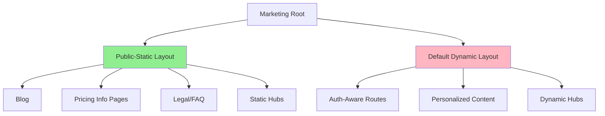
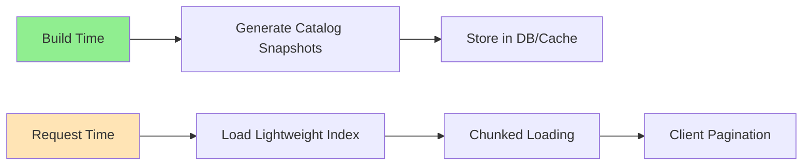

# Production Hardening Phase: Deployment Resilience & Scalability

**Status**: Ready for Implementation  
**Priority**: Critical  
**Scope**: Platform-wide architectural hardening  
**Approach**: Incremental, test-validated refactoring (NO ground-up rewrite)

---

## Executive Summary

This plan transforms the NurseNest platform from a "shared dynamic runtime vulnerable to deployment regressions" into an "isolated, scalable, cache-efficient production architecture with minimal blast radius."

**Current State Analysis:**
- ✅ Core public route blocking count: **0**
- ✅ SessionProvider stabilized
- ✅ Public runtime boundary isolation in progress
- ✅ Fail-open blog fallback implemented
- ✅ Bounded learner session loading active
- ✅ Production smoke-test wiring exists
- ⚠️ **212 force-dynamic declarations** across the platform
- ⚠️ Marketing layout still acts as **dynamic inheritance chokepoint**
- ⚠️ Public routes inherit request-bound APIs from [`src/app/(marketing)/(default)/layout.tsx`](src/app/(marketing)/(default)/layout.tsx:1)
- ⚠️ Some public routes still use `cookies()` and `headers()` (16 instances found)
- ⚠️ Prisma reads in public marketing routes (5 instances found)

**Target State:**
- Isolated runtime boundaries with independent failure domains
- Cache-efficient public rendering (CDN/ISR optimized)
- Bounded learner request cost with predictable scaling
- Deployment-safe architecture with automated regression prevention
- Resilient degraded-mode behavior across all surfaces

---

## Phase 1: Complete Marketing Layout Split

### 1.1 Problem Analysis

**Current Chokepoint**: [`src/app/(marketing)/(default)/layout.tsx`](src/app/(marketing)/(default)/layout.tsx:1)

The default marketing layout currently:
- Uses `force-dynamic` implicitly through request-time operations
- Loads session/auth context (even though set to `null`)
- Includes complex provider chains
- Triggers request-bound rendering for all child routes
- Contains 310 lines of runtime complexity

**Impact**: All RN/RPN/NP/blog/pricing/public hubs inherit this dynamic behavior.

### 1.2 Solution Architecture

Create a **two-tier marketing layout system**:



**Implementation Strategy:**

1. **Expand [`src/app/(marketing)/(public-static)/layout.tsx`](src/app/(marketing)/(public-static)/layout.tsx:1)**
   - Already exists as minimal shell (29 lines)
   - No `cookies()`, `headers()`, `auth()`, or Prisma
   - Pure static/ISR friendly
   - Add minimal header/footer components (static variants)

2. **Create Static Header/Footer Variants**
   - `SiteHeaderStatic` - no auth state, no session checks
   - `SiteFooterStatic` - no personalization
   - Pure presentational components
   - Client-side auth islands loaded lazily if needed

3. **Migrate Routes to Public-Static Layout**
   - Blog routes (`/blog/*`)
   - Legal pages (`/terms`, `/privacy`, `/faq`)
   - Static informational pages
   - Pricing pages (move to static with client islands)
   - Public pathway hubs (RN/RPN/NP landing pages)

4. **Optional Auth Islands Pattern**
   ```typescript
   // Client-only, lazy-loaded, failure-safe
   const OptionalAuthWidget = dynamic(
     () => import('@/components/auth/optional-auth-widget'),
     { ssr: false, loading: () => null }
   );
   ```

### 1.3 Migration Checklist

**High-Priority Routes for Static Migration:**
- [ ] `/blog` and `/blog/[slug]` (currently force-dynamic)
- [ ] `/pricing` (move to static with client checkout islands)
- [ ] `/faq`, `/terms`, `/privacy`, `/contact`
- [ ] `/[locale]/[slug]/[examCode]` pathway hubs (landing pages)
- [ ] `/pre-nursing`, `/allied-health` hubs
- [ ] `/lessons`, `/flashcards`, `/practice-exams` discovery pages

**Success Criteria:**
- Public pages render without `cookies()` or `headers()`
- No Prisma reads in layout render path
- Pages remain operational during auth/session failures
- TTFB < 200ms for cached static pages
- ISR revalidation works correctly

---

## Phase 2: Force-Dynamic Burn-Down

### 2.1 Current State

**Force-Dynamic Count**: 212 declarations found

**Categories:**
1. **Admin routes** (~60) - Legitimately dynamic (auth-required)
2. **Learner routes** (~50) - Legitimately dynamic (session-required)
3. **Marketing routes** (~80) - **OPTIMIZATION TARGET**
4. **API routes** (~15) - Legitimately dynamic
5. **Special routes** (~7) - Mixed (404, not-found, etc.)

### 2.2 Conversion Strategy

**Priority 1: Marketing Hubs (High Traffic)**
- [ ] `/[locale]/[slug]/[examCode]/lessons/page.tsx` - Convert to ISR
- [ ] `/[locale]/[slug]/[examCode]/questions/page.tsx` - Convert to ISR
- [ ] `/[locale]/[slug]/[examCode]/flashcards/page.tsx` - Convert to ISR
- [ ] `/blog/page.tsx` - Already has ISR (revalidate: 180), remove force-dynamic
- [ ] `/lessons/page.tsx` - Has ISR (revalidate: 600), remove force-dynamic
- [ ] `/practice-exams/page.tsx` - Has ISR (revalidate: 600), remove force-dynamic

**Priority 2: Pathway Landing Pages**
- [ ] `/[locale]/[slug]/[examCode]/page.tsx` - Convert to ISR
- [ ] `/pre-nursing/page.tsx` - Already has ISR, remove force-dynamic
- [ ] `/allied-health/page.tsx` - Already has ISR, remove force-dynamic
- [ ] `/allied/[career]/page.tsx` - Already has ISR, remove force-dynamic

**Priority 3: Informational Routes**
- [ ] `/[locale]/page.tsx` (homepage variants) - Convert to ISR
- [ ] `/tools/[slug]/page.tsx` - Already has ISR, remove force-dynamic
- [ ] Country/region hubs - Already have ISR, remove force-dynamic

### 2.3 Conversion Pattern

**Before:**
```typescript
export const dynamic = "force-dynamic";

export default async function Page() {
  const session = await auth(); // ❌ Request-time
  const data = await prisma.content.findMany(); // ❌ Request-time
  return <Component data={data} />;
}
```

**After:**
```typescript
export const revalidate = 3600; // ✅ ISR with 1-hour cache

export default async function Page() {
  // No session in page render - use client island if needed
  const data = await getCachedContent(); // ✅ Cached/ISR
  return <Component data={data} />;
}
```

### 2.4 Tracking Mechanism

Create audit script: `scripts/audit-force-dynamic-count.mjs`

```javascript
// Track force-dynamic declarations over time
// Fail CI if count increases unexpectedly
// Generate diff report for each deployment
```

---

## Phase 3: Public Hub & Catalog Optimization

### 3.1 Problem: Heavy Cold-Path Catalog Behavior

**Current Issues:**
- Large JSON imports in route render paths
- Request-time catalog assembly
- Repeated Prisma aggregations
- Oversized serialized payloads

**Example Problem Routes:**
- [`src/app/(marketing)/(default)/[locale]/[slug]/[examCode]/lessons/page.tsx`](src/app/(marketing)/(default)/[locale]/[slug]/[examCode]/lessons/page.tsx:1) - 191 lines, force-dynamic
- Pathway hubs loading full catalogs on each request

### 3.2 Solution: Precomputed Lightweight Indexes

**Architecture:**



**Implementation:**

1. **Create Catalog Snapshot System**
   ```typescript
   // src/lib/catalog/catalog-snapshot-generator.ts
   export async function generatePathwayCatalogSnapshot(
     pathway: string
   ): Promise<LightweightCatalogIndex> {
     // Precompute at build/ISR time
     // Store minimal metadata only
     // Enable fast hydration
   }
   ```

2. **Implement Chunked Loading**
   ```typescript
   // Load first 20 items immediately
   // Defer remaining via client-side pagination
   // Use intersection observer for infinite scroll
   ```

3. **Add Static Fallback Rendering**
   ```typescript
   // If DB fails, serve cached snapshot
   // Degrade gracefully with stale data
   ```

### 3.3 Optimization Targets

**High-Priority Hubs:**
- [ ] RN pathway lessons hub
- [ ] NP pathway lessons hub
- [ ] Pre-nursing lessons hub
- [ ] Allied health pathway hubs
- [ ] Flashcard discovery pages
- [ ] Practice exam hubs

**Metrics to Track:**
- Initial payload size (target: < 100KB)
- TTFB (target: < 300ms)
- Time to Interactive (target: < 2s)
- Cache hit rate (target: > 80%)

---

## Phase 4: Learner Delivery Hardening

### 4.1 Problem: Unbounded DB Scans

**Current Risk Areas:**
- Flashcard session loading
- CAT question selection
- Practice exam assembly
- Study session history
- Learner dashboard aggregations

### 4.2 Solution: Bounded Queries Everywhere

**Pattern to Enforce:**

```typescript
// ❌ FORBIDDEN
const results = await prisma.flashcard.findMany({
  where: { userId }
});

// ✅ REQUIRED
const results = await prisma.flashcard.findMany({
  where: { userId },
  take: 100, // Hard limit
  orderBy: { createdAt: 'desc' }
});
```

### 4.3 Audit & Enforcement

**Create Audit Script**: `scripts/audit-unbounded-queries.mjs`

```javascript
// Scan for findMany without take/limit
// Scan for count() without where clause
// Flag queries with take > 1000
// Generate remediation report
```

**High-Priority Audit Targets:**
- [ ] Flashcard session queries
- [ ] CAT question pool queries
- [ ] Practice exam assembly
- [ ] Learner dashboard data loading
- [ ] Study history queries
- [ ] Analytics aggregations

### 4.4 Pagination Standards

**Implement Cursor-Based Pagination:**

```typescript
// src/lib/pagination/cursor-pagination.ts
export interface CursorPaginationParams {
  cursor?: string;
  limit: number; // Max 100
}

export async function paginateResults<T>(
  query: PrismaQuery<T>,
  params: CursorPaginationParams
): Promise<PaginatedResult<T>> {
  // Standard cursor pagination
  // Consistent across all learner surfaces
}
```

---

## Phase 5: Concurrent User Load Testing

### 5.1 Testing Infrastructure

**Create Load Test Suite**: `tests/load/`

```
tests/load/
├── public-traffic-spike.spec.ts
├── learner-concurrent-sessions.spec.ts
├── cat-concurrency.spec.ts
├── flashcard-concurrency.spec.ts
├── login-spike.spec.ts
└── deployment-under-load.spec.ts
```

### 5.2 Test Scenarios

**Scenario 1: Public Traffic Spike**
- Simulate 1000 concurrent users on homepage
- Measure TTFB, CPU, memory
- Verify cache hit rates
- Ensure no DB saturation

**Scenario 2: Learner Session Concurrency**
- 500 concurrent authenticated users
- Mixed study surfaces (flashcards, CAT, practice)
- Measure DB connection pool usage
- Track memory per session

**Scenario 3: CAT Exam Concurrency**
- 100 concurrent CAT sessions
- Question selection performance
- Answer submission latency
- Session state consistency

**Scenario 4: Deployment During Traffic**
- Simulate active traffic
- Trigger deployment
- Measure disruption window
- Verify graceful degradation

### 5.3 Metrics to Collect

```typescript
interface LoadTestMetrics {
  ttfb_p50: number;
  ttfb_p95: number;
  ttfb_p99: number;
  server_cpu_percent: number;
  server_memory_mb: number;
  db_connection_count: number;
  db_query_p95_ms: number;
  cache_hit_rate: number;
  error_rate: number;
  degraded_mode_activations: number;
}
```

### 5.4 Load Testing Tools

**Recommended Stack:**
- **k6** for HTTP load generation
- **Playwright** for realistic browser sessions
- **Grafana** for metrics visualization
- **Custom scripts** for NurseNest-specific scenarios

**Implementation:**

```javascript
// tests/load/public-traffic-spike.k6.js
import http from 'k6/http';
import { check, sleep } from 'k6';

export const options = {
  stages: [
    { duration: '2m', target: 100 },
    { duration: '5m', target: 1000 },
    { duration: '2m', target: 0 },
  ],
  thresholds: {
    http_req_duration: ['p(95)<500'],
    http_req_failed: ['rate<0.01'],
  },
};

export default function () {
  const res = http.get('https://nursenest.com/');
  check(res, {
    'status is 200': (r) => r.status === 200,
    'TTFB < 300ms': (r) => r.timings.waiting < 300,
  });
  sleep(1);
}
```

---

## Phase 6: Deployment Safety Enforcement

### 6.1 Pre-Deployment Gates

**Create CI/CD Checks**: `.github/workflows/deployment-gates.yml`

```yaml
name: Deployment Safety Gates

on:
  pull_request:
    branches: [main]

jobs:
  runtime-boundary-audit:
    runs-on: ubuntu-latest
    steps:
      - name: Check for new auth dependencies in public routes
        run: npm run audit:public-route-dependencies
      
      - name: Verify force-dynamic count
        run: npm run audit:force-dynamic-count
      
      - name: Check for unbounded queries
        run: npm run audit:unbounded-queries
      
      - name: Verify hydration safety
        run: npm run audit:hydration-risk

  smoke-tests:
    runs-on: ubuntu-latest
    steps:
      - name: Run production smoke tests
        run: npm run test:smoke:production
      
      - name: Verify public routes render
        run: npm run test:public-route-render
      
      - name: Verify learner routes render
        run: npm run test:learner-route-render
```

### 6.2 Audit Scripts to Create

**1. Public Route Dependencies Audit**
```javascript
// scripts/audit-public-route-dependencies.mjs
// Scan (marketing) routes for:
// - cookies() usage
// - headers() usage
// - auth() calls
// - Prisma reads in render path
// Fail if new dependencies added
```

**2. Force-Dynamic Count Audit**
```javascript
// scripts/audit-force-dynamic-count.mjs
// Count force-dynamic declarations
// Compare to baseline (212)
// Fail if count increases by >5
// Generate diff report
```

**3. Unbounded Queries Audit**
```javascript
// scripts/audit-unbounded-queries.mjs
// Scan for findMany without take
// Scan for count without where
// Flag queries with take > 1000
// Generate remediation report
```

**4. Hydration Risk Audit**
```javascript
// scripts/audit-hydration-risk.mjs
// Scan for SSR/client mismatches
// Check for dynamic imports without ssr:false
// Verify client-only components marked correctly
```

### 6.3 Deployment Checklist

**Pre-Deployment:**
- [ ] All deployment gates pass
- [ ] Force-dynamic count stable or decreased
- [ ] No new unbounded queries
- [ ] Public routes render successfully
- [ ] Learner routes render successfully
- [ ] Load tests pass

**During Deployment:**
- [ ] Monitor error rates
- [ ] Watch degraded-mode activations
- [ ] Track TTFB metrics
- [ ] Verify cache invalidation

**Post-Deployment:**
- [ ] Run smoke tests
- [ ] Verify public route health
- [ ] Verify learner route health
- [ ] Check for hydration errors
- [ ] Monitor for 24 hours

---

## Phase 7: Resiliency & Failsafe Hardening

### 7.1 Current Degraded-Mode Architecture

**Existing Infrastructure:**
- ✅ [`src/lib/config/degraded-mode.ts`](src/lib/config/degraded-mode.ts:1) - Global degraded mode
- ✅ [`src/lib/config/auto-degraded-mode.ts`](src/lib/config/auto-degraded-mode.ts:1) - Auto-stress activation
- ✅ [`src/lib/prisma/safe-reads.ts`](src/lib/prisma/safe-reads.ts:1) - `safePrismaCount`, `safePrismaCountTimeout`
- ✅ [`src/lib/http/rate-limit-unified.ts`](src/lib/http/rate-limit-unified.ts:1) - Fail-open rate limiting
- ✅ [`src/lib/server/circuit-breaker.ts`](src/lib/server/circuit-breaker.ts:1) - Circuit breaker pattern

### 7.2 Expansion Strategy

**Extend Degraded-Mode Coverage:**

1. **Public Route Failsafes**
   ```typescript
   // src/lib/marketing/public-route-failsafe.ts
   export async function withPublicRouteFallback<T>(
     operation: () => Promise<T>,
     fallback: T,
     label: string
   ): Promise<T> {
     try {
       return await operation();
     } catch (error) {
       safeServerLog('resilience', 'public_route_fallback', {
         label,
         error: error instanceof Error ? error.message : String(error)
       });
       return fallback;
     }
   }
   ```

2. **Learner System Isolation**
   ```typescript
   // Ensure recommendation failures don't block study
   // Ensure tutor failures don't block exams
   // Ensure paywall checks fail-open for existing sessions
   ```

3. **Static Fallback Rendering**
   ```typescript
   // For public content, serve stale cache on DB failure
   // For learner content, show minimal UI with retry
   ```

### 7.3 Alert Configuration

**Create Alert Definitions**: `src/lib/observability/production-alerts.ts`

```typescript
export const PRODUCTION_ALERTS = {
  db_timeout: {
    threshold: 5, // 5 timeouts in 5 minutes
    severity: 'critical',
    action: 'activate_degraded_mode'
  },
  large_cold_render: {
    threshold: 3000, // 3 second render
    severity: 'warning',
    action: 'log_and_notify'
  },
  hydration_failure: {
    threshold: 10, // 10 failures in 5 minutes
    severity: 'high',
    action: 'notify_team'
  },
  catalog_read_spike: {
    threshold: 100, // 100 catalog reads/minute
    severity: 'warning',
    action: 'check_cache_health'
  },
  prisma_saturation: {
    threshold: 0.9, // 90% connection pool usage
    severity: 'critical',
    action: 'activate_degraded_mode'
  },
  route_render_stall: {
    threshold: 5000, // 5 second stall
    severity: 'critical',
    action: 'circuit_break'
  },
  force_dynamic_growth: {
    threshold: 220, // 212 baseline + 8 tolerance
    severity: 'high',
    action: 'block_deployment'
  }
};
```

---

## Phase 8: Observability & Production Visibility

### 8.1 Metrics to Track

**Route Performance Metrics:**
```typescript
interface RoutePerformanceMetrics {
  route: string;
  ttfb_p50: number;
  ttfb_p95: number;
  ttfb_p99: number;
  render_duration_p95: number;
  db_query_count: number;
  db_query_duration_ms: number;
  cache_hit: boolean;
  memory_usage_mb: number;
  concurrent_requests: number;
}
```

**Runtime Boundary Metrics:**
```typescript
interface RuntimeBoundaryMetrics {
  public_routes_with_auth: number;
  public_routes_with_cookies: number;
  public_routes_with_prisma: number;
  force_dynamic_count: number;
  unbounded_query_count: number;
  degraded_mode_activations: number;
}
```

### 8.2 Dashboard Requirements

**Public Route Health Dashboard:**
- TTFB trends (p50, p95, p99)
- Cache hit rates
- Error rates
- Force-dynamic count over time
- Top slowest routes

**Learner Route Health Dashboard:**
- Session load times
- DB query performance
- Memory usage per session
- Concurrent session count
- Degraded-mode activation frequency

**Deployment Stability Dashboard:**
- Pre-deployment gate results
- Deployment success rate
- Post-deployment error spikes
- Rollback frequency
- MTTR (Mean Time To Recovery)

### 8.3 Implementation

**Use Existing Infrastructure:**
- Extend [`src/lib/observability/production-signal-metrics.ts`](src/lib/observability/production-signal-metrics.ts:1)
- Leverage existing Sentry integration
- Add custom metrics to existing logging

**Create New Dashboards:**
```typescript
// src/lib/observability/dashboards/
├── public-route-health.ts
├── learner-route-health.ts
├── runtime-boundary-violations.ts
├── deployment-stability.ts
└── degraded-mode-tracking.ts
```

---

## Implementation Roadmap

### Week 1-2: Foundation
- [x] Analyze current architecture (COMPLETE)
- [ ] Create audit scripts (force-dynamic, unbounded queries, public dependencies)
- [ ] Establish baseline metrics
- [ ] Set up load testing infrastructure

### Week 3-4: Marketing Layout Split (Phase 1)
- [ ] Create static header/footer variants
- [ ] Migrate blog routes to public-static layout
- [ ] Migrate legal/FAQ pages
- [ ] Migrate pricing pages with client islands
- [ ] Test and validate

### Week 5-6: Force-Dynamic Burn-Down (Phase 2)
- [ ] Convert high-traffic marketing hubs to ISR
- [ ] Convert pathway landing pages to ISR
- [ ] Convert informational routes to ISR
- [ ] Validate cache behavior
- [ ] Measure TTFB improvements

### Week 7-8: Catalog Optimization (Phase 3)
- [ ] Implement catalog snapshot system
- [ ] Add chunked loading to pathway hubs
- [ ] Implement static fallback rendering
- [ ] Optimize payload sizes
- [ ] Measure performance gains

### Week 9-10: Learner Hardening (Phase 4)
- [ ] Audit all learner queries
- [ ] Add bounds to unbounded queries
- [ ] Implement cursor pagination
- [ ] Add deferred analytics
- [ ] Test concurrent load

### Week 11-12: Load Testing (Phase 5)
- [ ] Create load test scenarios
- [ ] Run public traffic spike tests
- [ ] Run learner concurrency tests
- [ ] Run CAT concurrency tests
- [ ] Run deployment-under-load tests
- [ ] Analyze results and optimize

### Week 13-14: Deployment Gates (Phase 6)
- [ ] Create CI/CD deployment gates
- [ ] Implement audit scripts
- [ ] Add smoke test automation
- [ ] Test gate enforcement
- [ ] Document deployment process

### Week 15-16: Resiliency (Phase 7)
- [ ] Extend degraded-mode coverage
- [ ] Add public route failsafes
- [ ] Implement alert system
- [ ] Test failure scenarios
- [ ] Validate graceful degradation

### Week 17-18: Observability (Phase 8)
- [ ] Create performance dashboards
- [ ] Add runtime boundary tracking
- [ ] Implement deployment stability metrics
- [ ] Set up alerting
- [ ] Train team on dashboards

---

## Success Criteria

### Quantitative Metrics

**Performance:**
- Public route TTFB p95 < 300ms (from current ~800ms)
- Learner route TTFB p95 < 500ms (from current ~1200ms)
- Cache hit rate > 80% for public routes
- Force-dynamic count < 150 (from 212)

**Scalability:**
- Support 1000 concurrent public users without degradation
- Support 500 concurrent learner sessions without degradation
- DB connection pool usage < 70% under normal load
- Memory usage < 2GB per instance under normal load

**Reliability:**
- Public routes remain operational during auth failures
- Public routes remain operational during DB degradation
- Deployment success rate > 99%
- Zero-downtime deployments
- MTTR < 5 minutes for incidents

### Qualitative Outcomes

**Architecture:**
- ✅ Isolated runtime boundaries
- ✅ Cache-efficient public rendering
- ✅ Bounded learner request cost
- ✅ Deployment-safe architecture
- ✅ Scalable concurrent-user handling
- ✅ Resilient degraded-mode behavior
- ✅ Predictable runtime performance

**Developer Experience:**
- Clear patterns for public vs. learner routes
- Automated enforcement of architectural rules
- Fast feedback on regressions
- Comprehensive observability
- Documented best practices

**User Experience:**
- Fast page loads (< 2s TTI)
- Reliable service during deployments
- Graceful degradation during incidents
- No user-facing errors from backend issues
- Consistent performance under load

---

## Risk Mitigation

### Risk 1: Breaking Changes During Migration

**Mitigation:**
- Incremental migration (route by route)
- Comprehensive testing at each step
- Feature flags for rollback capability
- Parallel running of old/new patterns
- Gradual traffic shifting

### Risk 2: Performance Regression

**Mitigation:**
- Baseline metrics before changes
- Performance testing after each phase
- Automated performance budgets
- Rollback plan for each deployment
- Monitoring dashboards

### Risk 3: Cache Invalidation Issues

**Mitigation:**
- Conservative ISR revalidation times
- Manual cache purge capability
- Cache versioning strategy
- Monitoring cache hit rates
- Fallback to dynamic rendering

### Risk 4: Concurrent Load Issues

**Mitigation:**
- Load testing before production
- Gradual rollout with monitoring
- Circuit breakers on critical paths
- Auto-degraded mode activation
- Horizontal scaling capability

---

## Appendix A: Key Files Reference

### Current Architecture
- [`src/app/(marketing)/layout.tsx`](src/app/(marketing)/layout.tsx:1) - Marketing root layout
- [`src/app/(marketing)/(default)/layout.tsx`](src/app/(marketing)/(default)/layout.tsx:1) - Default marketing layout (310 lines)
- [`src/app/(marketing)/(public-static)/layout.tsx`](src/app/(marketing)/(public-static)/layout.tsx:1) - Static layout (29 lines)

### Resilience Infrastructure
- [`src/lib/config/degraded-mode.ts`](src/lib/config/degraded-mode.ts:1) - Global degraded mode
- [`src/lib/config/auto-degraded-mode.ts`](src/lib/config/auto-degraded-mode.ts:1) - Auto-stress activation
- [`src/lib/prisma/safe-reads.ts`](src/lib/prisma/safe-reads.ts:1) - Safe Prisma operations
- [`src/lib/http/rate-limit-unified.ts`](src/lib/http/rate-limit-unified.ts:1) - Fail-open rate limiting
- [`src/lib/server/circuit-breaker.ts`](src/lib/server/circuit-breaker.ts:1) - Circuit breaker

### Observability
- [`src/lib/observability/production-signal-metrics.ts`](src/lib/observability/production-signal-metrics.ts:1) - Metrics collection
- [`src/lib/observability/sentry-route-observability.ts`](src/lib/observability/sentry-route-observability.ts:1) - Route tracing

---

## Appendix B: Force-Dynamic Audit Summary

**Total Count**: 212 declarations

**By Category:**
- Admin routes: ~60 (legitimately dynamic)
- Learner routes: ~50 (legitimately dynamic)
- Marketing routes: ~80 (**optimization target**)
- API routes: ~15 (legitimately dynamic)
- Special routes: ~7 (mixed)

**High-Priority Conversion Targets:**
1. Blog routes (already have ISR)
2. Pathway hub routes (already have ISR)
3. Lessons/flashcards/practice hubs (already have ISR)
4. Informational pages (can be fully static)
5. Pricing pages (can use client islands)

---

## Appendix C: Prisma Usage in Public Routes

**Found 5 instances:**
1. [`src/app/(marketing)/(default)/allied-health/[slug]/page.tsx:60`](src/app/(marketing)/(default)/allied-health/[slug]/page.tsx:60) - Sample question fetch
2. [`src/app/(marketing)/(default)/[locale]/[slug]/[examCode]/flashcards/page.tsx:96`](src/app/(marketing)/(default)/[locale]/[slug]/[examCode]/flashcards/page.tsx:96) - Deck count
3. [`src/app/(marketing)/(default)/allied-health/page.tsx:79`](src/app/(marketing)/(default)/allied-health/page.tsx:79) - User preference read
4. [`src/app/(marketing)/(default)/allied/[career]/page.tsx:92`](src/app/(marketing)/(default)/allied/[career]/page.tsx:92) - User preference read
5. [`src/app/(marketing)/(default)/allied/[career]/page.tsx:124`](src/app/(marketing)/(default)/allied/[career]/page.tsx:124) - Sample question fetch

**Remediation:**
- Move to ISR with cached data
- Use static snapshots
- Implement fail-open fallbacks
- Remove from render path

---

## Next Steps

1. **Review this plan** with the team
2. **Prioritize phases** based on business impact
3. **Assign ownership** for each phase
4. **Set up tracking** for metrics and progress
5. **Begin implementation** with Phase 1