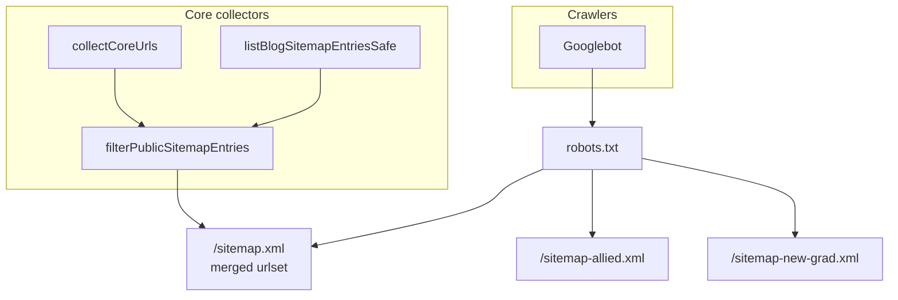
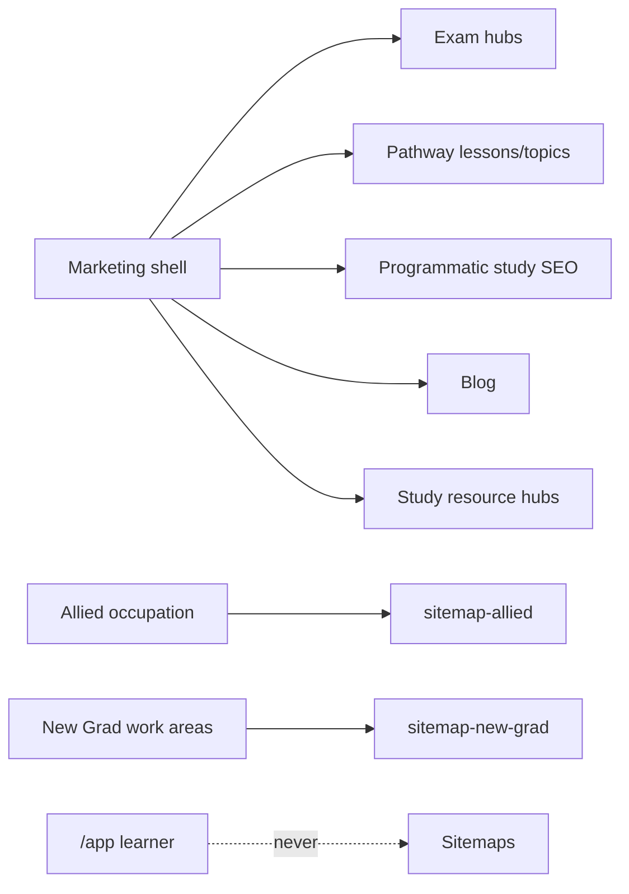
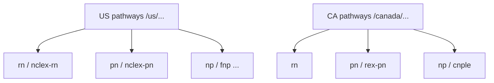
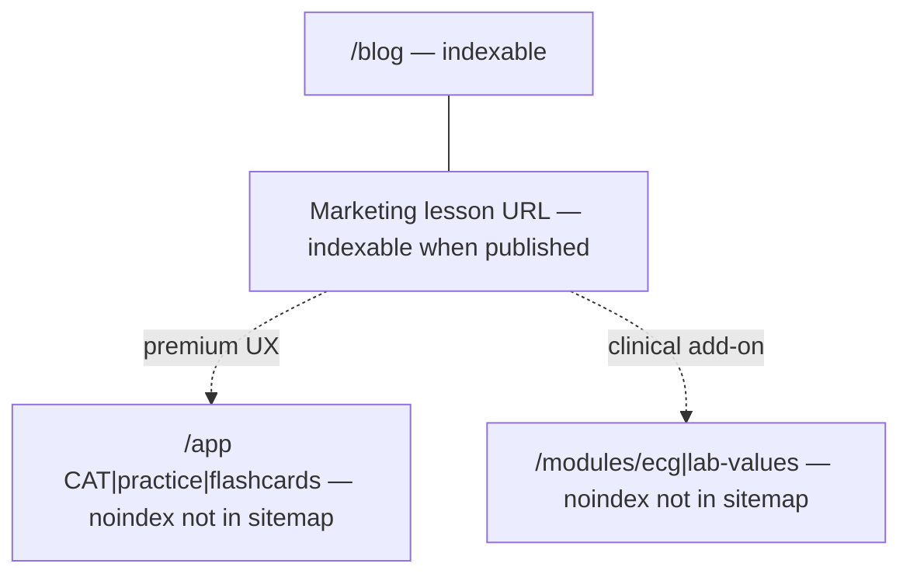

# Sitemap IA diagrams (Mermaid)

Figma MCP was not used (no authenticated design export in this run). To export to FigJam later: paste Mermaid into a diagram tool or use `generate_diagram` after `figma-generate-diagram` skill + user session.

## Overall architecture (today)

## Content clustering (logical, not Google-guaranteed)

## RN / RPN / NP ecosystems (URL shape)

## Blog ↔ lesson ↔ module (indexing boundary)

